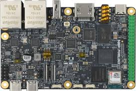

# FRDM-IMX93 Quickstart (Zephyr on the Cortex-A55)



The NXP FRDM-IMX93 is an application processor board: two Cortex-A55 cores
(which normally run Linux) and one Cortex-M33 companion. For a Zephyr
/IOTCONNECT IP client the target is the A55, where the Ethernet MAC and
Zephyr's network support live; the M33 has no Ethernet. Zephyr runs bare-metal
on the A55 from DRAM.

| | |
|---|---|
| SoC | i.MX93 (MIMX9352: 2x Cortex-A55, 1x Cortex-M33) |
| Build target | `frdm_imx93/mimx9352/a55` (arm64) |
| Connectivity | Ethernet — ENET MAC (RGMII), Motorcomm YT8521 PHY, DHCP |
| Console | `lpuart2` at 115200 8N1 (the debug USB exposes A55 and M33 ports) |
| Debug / flash | SEGGER J-Link (`--runner jlink`) to the A55, or an SPSDK SD boot image |

Both the telemetry and quickstart demonstrations are hardware-verified on this
board: booting an SPSDK SD image, Zephyr on the A55 brings up gigabit Ethernet
and connects to AWS IoT Core with mutual TLS. The board has two RJ45 jacks —
use the ENET jack — and two debug COM ports: SPL/ATF boot messages print on
one, Zephyr's console on `lpuart2`.

The [gateway](../../demos/gateway) demonstration also targets this board: an
IOTCONNECT gateway that ingests
[uart-telemetry-source](../../demos/uart-telemetry-source) MCUs over `lpuart1`
as child devices and spools telemetry to the on-SOM eMMC while the uplink is
down.

## Toolchain

The A55 is arm64, so the workspace needs the `aarch64-zephyr-elf` toolchain in
addition to the Cortex-M one:

```sh
west sdk install -t aarch64-zephyr-elf -d <your-zephyr-sdk-dir>
```

## Building

```sh
west build -p always -b frdm_imx93/mimx9352/a55 -d build/imx93a55 \
  demos/telemetry \
  -- -DZEPHYR_EXTRA_MODULES=<path>/iotc-zephyr-sdk \
     -DZEPHYR_IOTC_C_LIB_MODULE_DIR=<path>/iotc-c-lib
```

The board files:

- [`boards/frdm_imx93_mimx9352_a55.conf`](../../demos/telemetry/boards/frdm_imx93_mimx9352_a55.conf)
  enables the ENET driver, the network stack, and DHCP, and disables
  NVS/settings (the bare-metal A55 has no NOR flash), so the telemetry demo
  takes its identity from the compiled-in credentials header.
- [`boards/frdm_imx93_mimx9352_a55.overlay`](../../demos/telemetry/boards/frdm_imx93_mimx9352_a55.overlay)
  extends the Zephyr DRAM window from the 1 MB board default to 16 MB, which
  arm64 plus networking and TLS require.

## Loading and running

The A55 image runs from DRAM at `0xd0000000`, so DDR must be initialized
before the image is loaded. Two paths:

**J-Link into DRAM (development loop).** Boot the board through its normal SD
boot to the U-Boot prompt (SPL initializes DDR), then load Zephyr into DDR:

```sh
west flash -d build/imx93a55 --runner jlink
```

The J-Link runner does not program flash; it loads the image into the
already-initialized DDR and runs it.

**SPSDK SD boot image (standalone, no Linux).** Package Zephyr with the NXP
boot firmware into a self-booting `flash.bin` — ELE AHAB container, LPDDR
training firmware, U-Boot SPL, ATF, and the Zephyr A55 image — and write it to
the SD card at the 32 KB boot offset. The ROM loads it, SPL brings up DDR, and
ATF jumps to Zephyr; no Linux or U-Boot remains on the card.

```sh
pip install spsdk
# fetch the i.MX93 boot firmware blob:
west blobs fetch hal_nxp -l ".*imx93evk.*" -a
# build with the SPSDK image post-step (requires 7-Zip on PATH):
USE_NXP_SPSDK_IMAGE=y west build -p always -b frdm_imx93/mimx9352/a55 -d build/imx93a55 \
  demos/telemetry -- -DZEPHYR_EXTRA_MODULES=<path>/iotc-zephyr-sdk \
                     -DZEPHYR_IOTC_C_LIB_MODULE_DIR=<path>/iotc-c-lib
# produces build/imx93a55/zephyr/flash.bin
```

Write `flash.bin` to the SD card at the 32 KB offset. On Linux:
`sudo dd if=flash.bin of=/dev/sdX bs=1k seek=32 conv=fsync`. On Windows
(administrator PowerShell), clear the card and raw-write at offset 32768; the
write length must be sector-aligned (pad to a 4 KB multiple) or the raw write
fails. Alternatively, `west flash --runner spsdk` loads the image over USB
serial download with the board in download mode, with no SD card involved.

Set the boot switches to SD, insert the card, and power on. Open the A55 COM
port (`lpuart2`) at 115200; the device runs the same discovery, mutual-TLS
MQTT, and telemetry flow as the other boards.

## Quickstart variant: runtime provisioning with eMMC persistence

The [quickstart](../../demos/quickstart) demonstration is the releasable
image for this board: no compiled-in device identity (only public CA roots),
on-device EC P-256 key generation, and the `iotcprov`/`iotc` provisioning
shell. Any user can write this one `flash.bin` to an SD card, provision the
device to their own IOTCONNECT account, and connect — no toolchain required.
This flow is hardware-verified.

### Where the identity is stored

The bare-metal A55 has no NOR flash and no NVS, so the provisioned identity is
written to raw reserved sectors on a block device. The boot SD card itself
cannot be used: per the board documentation, when the ROM boots from the
uSDHC2 SD card that controller must not also be driven from Zephyr (the card
initializes, but the first data transfer stalls). The identity is therefore
persisted to the on-SOM eMMC on uSDHC1 — a separate controller the boot ROM
does not touch — which comes up at HS200 and reads and writes cleanly.

The standalone SPSDK boot chain leaves the uSDHC root clocks unconfigured, so
the SDK configures them in the identity layer before the first block access;
this is automatic for this SoC.

Board configuration (see
[`demos/quickstart/boards/`](../../demos/quickstart/boards/)):

```conf
CONFIG_IOTCONNECT_IDENTITY_DISK=y
CONFIG_IOTCONNECT_IDENTITY_DISK_NAME="SD2"       # eMMC on uSDHC1
CONFIG_IOTCONNECT_IDENTITY_DISK_SECTOR=20000000  # well clear of any factory image
CONFIG_DISK_ACCESS=y
CONFIG_DISK_DRIVER_MMC=y
CONFIG_MMC_STACK=y
CONFIG_SDHC=y
```

Sixteen sectors (8 KB) at the configured offset hold the packed identity
(cpid, environment, DUID, certificate, key). Note that this overwrites any
factory eMMC content at that offset; the board continues to boot from the SD
card regardless.

### Build, provision, and run

Build as above, pointing at `demos/quickstart`, and write the resulting
`flash.bin` to the SD card. The device boots unprovisioned and prints a
guide:

```text
uart:~$ iotcprov provision <your-duid>
```

The device generates the key and certificate, persists the identity to the
eMMC, and prints the certificate. In /IOTCONNECT, create the device
(import
[templates/zephyr-telemetry-template.json](../../templates/zephyr-telemetry-template.json)
first if you have no template; Self-Signed authentication, paste the
certificate), download
`iotcDeviceConfig.json`, and paste it at the `iotc config` prompt.

To connect, power-cycle the board. (`kernel reboot cold` has no effect on
this bare-metal A55 target — there is no software reset path.) On the next
power-up the SDK reads the identity back from the eMMC and connects
automatically.

## Notes

- DRAM carveout: the overlay places Zephyr at `0xd0000000` with a 16 MB
  window. If Linux also runs on this board, ensure its reserved-memory node
  matches so the two do not collide.
- Entropy: confirm a hardware RNG source (the i.MX93 ELE) is wired for
  production use; TLS requires genuine entropy.
- There is no hardware-sealed key store on this path — the eMMC region is
  plaintext reserved sectors. A sealed key on this SoC would be an ELE
  integration effort, distinct from the TF-M path on the FRDM-MCXN947.
- The i.MX93's streaming use case (Linux on the A55 with KVS/WebRTC video) is
  a separate track; this Zephyr path is the direct-IP telemetry and control
  client.

## Demonstrations for this board

See the demonstration list and verification status in
[README_NXP.md](../../README_NXP.md#frdm-imx93).
