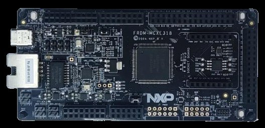

# FRDM-MCXE31B Quickstart



The MCX E31B has no network hardware, so this board does not connect to
/IOTCONNECT directly. It runs the
[uart-telemetry-source](../../demos/uart-telemetry-source) demonstration:
the device builds IOTCONNECT telemetry JSON locally and emits it over UART
for a gateway — such as the [i.MX93 gateway](../../demos/gateway) — to
forward to the platform.

| | |
|---|---|
| SoC | MCXE31B (Cortex-M7 at 160 MHz, functional-safety/industrial) |
| Build target | `frdm_mcxe31b` |
| Connectivity | None (CAN FD ×2 on-chip); telemetry via UART to a gateway |
| Debug probe / console | Onboard MCU-Link (CMSIS-DAP), USB VCom at 115200 8N1 |

## Requirements

- FRDM-MCXE31B and a USB-C cable to the MCU-Link port.
- NXP LinkServer (see [HOST-SETUP.md](../HOST-SETUP.md) for installing it
  and the serial console on Windows or Linux).
- A Zephyr workspace with this repository (the demonstration builds from
  source; no cloud credentials are involved).

## Build & flash

```sh
west build -p always -b frdm_mcxe31b -d build/uart_src_mcxe31b \
  demos/uart-telemetry-source \
  -- -DZEPHYR_IOTC_C_LIB_MODULE_DIR=<path>/iotc-c-lib
west flash -d build/uart_src_mcxe31b     # LinkServer runner
```

## Expected result

Open the MCU-Link VCom at 115200 8N1: an `IOTC-TELEMETRY:` line with an
IOTCONNECT 2.1 JSON record appears every 5 seconds. Wire the board's UART to
a gateway to forward it — the [gateway demonstration](../../demos/gateway)
consumes this format (template `gateway-template.json`, tag `uartsrc`, child
device id `frdmmcxe31b01`); see the
[uart-telemetry-source README](../../demos/uart-telemetry-source/README.md)
for the wiring and framing details.

## Demonstrations for this board

See [README_NXP.md](../../README_NXP.md#frdm-mcxe31b-and-frdm-mcxw72).
