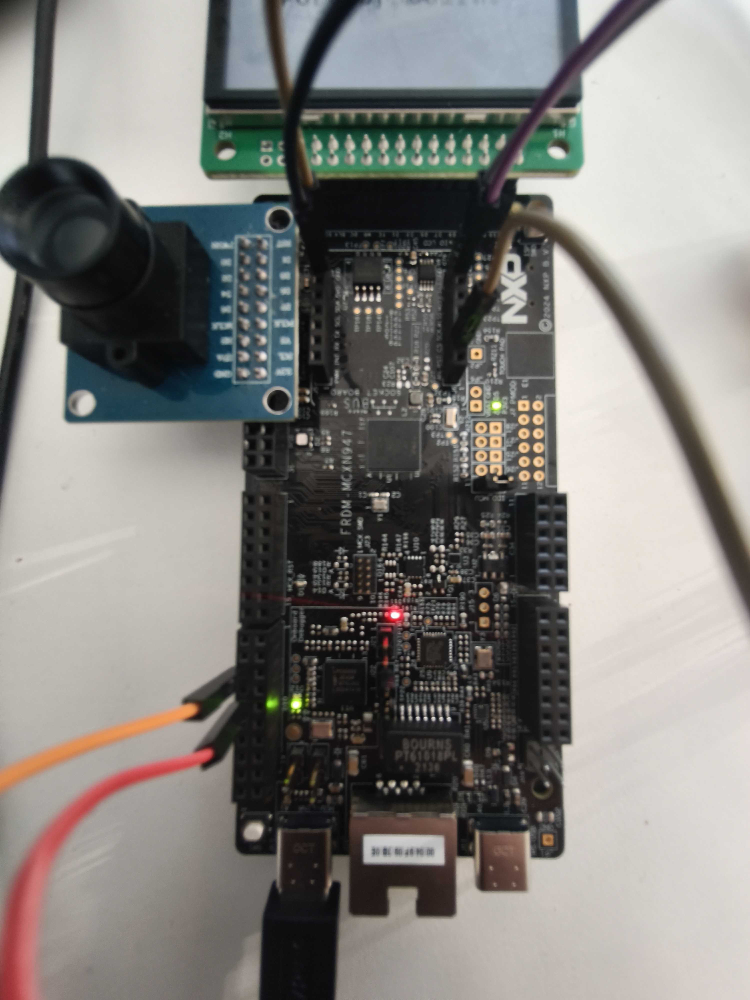

# FRDM-MCXN947 Quickstart



This guide provisions an NXP FRDM-MCXN947 to Avnet /IOTCONNECT using a prebuilt
binary. Device identity is generated on the device itself; no credentials are
stored on the host PC or compiled into the binary.

| | |
|---|---|
| SoC | MCXN947 (dual Cortex-M33) |
| Build target | `frdm_mcxn947/mcxn947/cpu0` (`/ns` for the TF-M build) |
| Connectivity | Onboard Ethernet (ENET-QoS MAC, Microchip LAN8741 PHY), DHCP |
| Debug probe / console | Onboard MCU-Link (CMSIS-DAP), USB VCom at 115200 8N1 |

## Requirements

- FRDM-MCXN947, a USB-C cable to the MCU-Link port, and an Ethernet connection
  with DHCP.
- An /IOTCONNECT account. Free trials are available:
  [via AWS Marketplace](https://github.com/avnet-iotconnect/avnet-iotconnect.github.io/blob/main/documentation/iotconnect/subscription/iotconnect_aws_marketplace.md)
  (60 days, AWS account required) or
  [via iotconnect.io](https://subscription.iotconnect.io/subscribe?cloud=aws)
  (30 days, no credit card). Check your spam folder for the temporary
  password after registering.
- A flashing tool: NXP LinkServer, MCUXpresso, or a J-Link. No Zephyr toolchain
  is required to use the prebuilt binary.
- A serial terminal at 115200 8N1.

Starting from a machine with neither installed? [HOST-SETUP.md](../HOST-SETUP.md)
helps you choose between LinkServer and J-Link, install either on Windows or
Linux, verify the probe, and open the serial console.

## Flashing

```sh
LinkServer flash MCXN947:FRDM-MCXN947 load --addr 0x10000000 zephyr.bin
# or, from a Zephyr workspace:
west flash -d build/quickstart_n947
```

Download `frdm_mcxn947_quickstart.hex` from the
[Releases page](https://github.com/avnet-iotconnect/iotc-zephyr-demos/releases),
or build [demos/quickstart](../../demos/quickstart) from source — the
artifact lands in `build/<name>/zephyr/zephyr.hex`.

Known issue: if Ethernet fails to initialize with
`eth_nxp_enet_qos_mac: Can't clear SWR` on the console, the PHY's RMII
reference clock is not reaching the SoC. The usual cause is board rework —
NXP's camera and LCD demonstration setups move solder jumpers that re-route
the shared ENET pins, disconnecting Ethernet in hardware until the jumpers
are restored. The PHY still responds over MDIO and reports link, so the
failure is easily misread as a software problem.

## Provisioning

Open the MCU-Link VCom port. On first boot the device prints a provisioning
guide. Then:

1. Generate the device identity on the device. Choose a DUID (Device Unique ID) for the board — you invent this
   yourself: up to 10 characters, letters and digits only, and it must
   start with a letter (e.g. `n947a`). Then:
   ```
   iotcprov provision <your-duid>
   ```
   The device generates an EC P-256 key and self-signed certificate on-chip
   and prints the certificate.
2. In /IOTCONNECT, first import the device template for the demonstration
   you flashed — the template is fixed when the device is created. In
   [console.iotconnect.io](https://console.iotconnect.io): hover the
   processor icon, select **Device**, open the **Templates** tab, then
   **Create Template** → **Import** the file and save.

   
   

   Templates for this board's demonstrations:

   | Demonstration | Template |
   |---|---|
   | quickstart, telemetry | [templates/zephyr-telemetry-template.json](../../templates/zephyr-telemetry-template.json) |
   | c2d-led | [templates/c2d-led-template.json](../../templates/c2d-led-template.json) |
   | click-telemetry | [templates/click-demos-device-template.JSON](../../templates/click-demos-device-template.JSON) |
   | eiq-pdm-vibration | [templates/eiq-pdm-vibration-template.json](../../templates/eiq-pdm-vibration-template.json) |

   Then open the **Devices** tab → **Create Device**: set the Unique ID
   (and Device Name) to your chosen DUID, pick the imported template,
   choose **Use my certificate**, paste the certificate the board
   printed (including the BEGIN/END lines), and click **Save and View**.

   
   
   
3. On the device's page, click the paper-and-cog icon (top right, above
   "Connection Info") to download `iotcDeviceConfig.json`, then paste
   its contents at the prompt:

   

   ```
   iotc config
   { ...paste the JSON block... }
   ```
4. Reboot to connect:
   ```
   kernel reboot cold
   ```
   The board comes up as your device and begins streaming telemetry.

## Board notes

- Flash-recovery: after an application has run, the MCXN947's debug MEM-AP can
  become unreachable and a plain reflash may fail
  (`Cannot find MEM-AP` / `Flash operation exited with code 1`). Unplug and
  replug the MCU-Link USB to fully power-cycle the board, then flash within a
  few seconds.
- Ethernet is enabled by the demo board overlay
  (`boards/frdm_mcxn947_mcxn947_cpu0.overlay`).
- The stored identity survives an application reflash.

## Hardware-backed key protection (TF-M build)

The MCXN947 is a Cortex-M33 with TrustZone-M and an EdgeLock secure subsystem,
and Zephyr provides a TF-M target for it (`frdm_mcxn947/mcxn947/cpu0/ns`).
Built this way with `CONFIG_IOTCONNECT_USE_PSA_PROTECTED_STORAGE`, the device
key is sealed in hardware-backed PSA Protected Storage rather than stored in
plaintext NVS. This path is hardware-verified end to end: the device
provisions itself, seals the identity, survives reboot and reflash, and
connects to AWS IoT Core with mutual TLS, with all cryptography running in the
TF-M secure world. See the SDK
[key-protection matrix](https://github.com/avnet-iotconnect/iotc-zephyr-sdk/blob/main/docs/provisioning-nvs.md#key-protection--tf-m-capability-per-board).

Building the `/ns` image from source requires one-time host tooling and module
patches (not needed to flash the prebuilt image):

```sh
pip install cryptography cbor2 pyyaml jinja2 click imgtool

# Module patches for the TF-M build (re-apply after any `west update`);
# see iotc-zephyr-sdk/patches/README.md for what each one does:
(cd <zephyrproject>/modules/crypto/mbedtls && \
   git apply <path>/iotc-zephyr-sdk/patches/mbedtls-ssl-premaster-ecp-max-bytes.patch)
(cd <zephyrproject>/modules/tee/tf-m/trusted-firmware-m && \
   git apply <path>/iotc-zephyr-sdk/patches/tfm-frdmmcxn947-ram-rebalance-region-defs.patch)
(cd <zephyrproject>/zephyr && \
   git apply <path>/iotc-zephyr-sdk/patches/zephyr-frdmmcxn947-ns-ram-rebalance-dts.patch)

west build -p always -b frdm_mcxn947/mcxn947/cpu0/ns demos/quickstart \
  -- -DZEPHYR_EXTRA_MODULES=<path>/iotc-zephyr-sdk \
     -DZEPHYR_IOTC_C_LIB_MODULE_DIR=<path>/iotc-c-lib
west flash -d build/<name>    # flashes the merged secure + non-secure image
```

Implementation notes: the identity (cpid, env, DUID, certificate, key) is
stored as a single packed Protected Storage asset, since the TF-M PS
filesystem reserves a full slot per asset and allows only a few. Live TLS
credentials use the volatile backend — loaded from the sealed blob into RAM
for the handshake. The `/ns` configuration is sized to fit the non-secure RAM
partition; see the comments in `boards/frdm_mcxn947_mcxn947_cpu0_ns.conf`.

The click-telemetry demonstration also runs on the sealed-key `/ns` build and
is hardware-verified streaming four Click sensors to AWS IoT Core. Provision
once with the quickstart flow; either image then loads the sealed identity.

## Demonstrations for this board

See the demonstration list and verification status in
[README_NXP.md](../../README_NXP.md#frdm-mcxn947).
