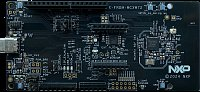

# FRDM-MCXW72 Quickstart



The MCXW72's radio is 802.15.4/BLE — it has no IP-capable bearer in Zephyr —
so this board does not connect to /IOTCONNECT directly. It runs the
[uart-telemetry-source](../../demos/uart-telemetry-source) demonstration:
the device builds IOTCONNECT telemetry JSON locally and emits it over UART
for a gateway — such as the [i.MX93 gateway](../../demos/gateway) — to
forward to the platform.

| | |
|---|---|
| SoC | MCXW727C (Cortex-M33, multiprotocol 802.15.4 + BLE radio) |
| Build target | `frdm_mcxw72/mcxw727c/cpu0` |
| Connectivity | 802.15.4/BLE only; telemetry via UART to a gateway |
| Debug probe / console | Onboard debugger runs **J-Link OB** firmware, USB VCom at 115200 8N1 |

## Requirements

- FRDM-MCXW72 and a USB-C cable to the debug port.
- SEGGER J-Link software — the onboard debugger is J-Link OB, so LinkServer
  sees no probe on this board (see [HOST-SETUP.md](../HOST-SETUP.md),
  Option B).
- A Zephyr workspace with this repository (the demonstration builds from
  source; no cloud credentials are involved).

## Build & flash

```sh
west build -p always -b frdm_mcxw72/mcxw727c/cpu0 -d build/uart_src_mcxw72 \
  demos/uart-telemetry-source \
  -- -DZEPHYR_IOTC_C_LIB_MODULE_DIR=<path>/iotc-c-lib
```

`west flash --runner jlink` can hang on a firmware-update prompt on this
probe; the reliable path drives J-Link Commander with the script that ships
in the demo:

```sh
cd demos/uart-telemetry-source
JLink -nogui 1 -if SWD -speed 4000 \
  -device MCXW727 -AutoConnect 1 -ExitOnError 1 -CommanderScript flash.jlink
```

## Expected result

Open the board's VCom at 115200 8N1: an `IOTC-TELEMETRY:` line with an
IOTCONNECT 2.1 JSON record appears every 5 seconds. Wire the board's UART to
a gateway to forward it — the [gateway demonstration](../../demos/gateway)
consumes this format (template `gateway-template.json`, tag `uartsrc`, child
device id `frdmmcxw7201`); see the
[uart-telemetry-source README](../../demos/uart-telemetry-source/README.md)
for the wiring and framing details.

## Demonstrations for this board

See [README_NXP.md](../../README_NXP.md#frdm-mcxe31b-and-frdm-mcxw72).
