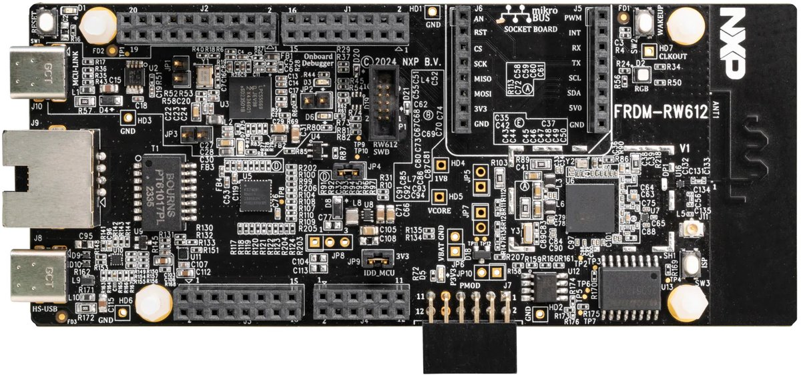

# FRDM-RW612 Quickstart



This guide provisions an NXP FRDM-RW612 to Avnet /IOTCONNECT over Wi-Fi using
a prebuilt binary. Nothing device- or network-specific is compiled into the
image: the Wi-Fi credentials are entered at the serial prompt and stored in
flash, and the device generates its own key and certificate on-chip. One
binary works on any network and any IOTCONNECT account.

| | |
|---|---|
| SoC | RW612 (Cortex-M33 at 260 MHz, tri-radio: Wi-Fi 6 + BLE + 802.15.4) |
| Build target | `frdm_rw612` |
| Connectivity | Onboard 2.4/5 GHz 802.11ax Wi-Fi, DHCP |
| Debug probe / console | Onboard MCU-Link (CMSIS-DAP), USB VCom at 115200 8N1 |

## Requirements

- FRDM-RW612 and a USB-C cable to the MCU-Link port (`J10`, the USB-C
  connector nearest the RESET button).
- A 2.4 or 5 GHz WPA2-PSK (or open) Wi-Fi network.
- An [IOTCONNECT](https://www.iotconnect.io/) account (a free trial works).
- A flashing tool: NXP LinkServer, MCUXpresso, or a J-Link (the MCU-Link can
  be reflashed with J-Link firmware). No Zephyr toolchain is required to use
  the prebuilt binary.
- A serial terminal at 115200 8N1. The MCU-Link enumerates as a USB serial
  port when the board is plugged in.

Starting from a machine with neither installed? [HOST-SETUP.md](../HOST-SETUP.md)
helps you choose between LinkServer and J-Link, install either on Windows or
Linux, verify the probe, and open the serial console.

## Flashing

The image is `zephyr.hex` (flash addresses embedded — no load address needed):

```sh
LinkServer flash RW612:FRDM-RW612 load zephyr.hex
# or, from a Zephyr workspace:
west flash -d build/quickstart_rw612
```

Download `frdm_rw612_quickstart.hex` from the
[Releases page](https://github.com/avnet-iotconnect/iotc-zephyr-demos/releases)
(prebuilt images for all three of this board's demonstrations, with
checksums), or build from source (see [Building](#building-optional) below —
the artifact lands in `build/quickstart_rw612/zephyr/zephyr.hex`).

## Provisioning

Open the MCU-Link serial port. On first boot the device prints this guide on
its console. Then:

1. Store the Wi-Fi credentials (they persist in flash and survive both
   reboots and application reflashes):
   ```
   wifi cred add -s "<ssid>" -k 1 -p "<passphrase>"
   ```
   (`-k 1` is WPA2-PSK; use `-k 0` and no `-p` for an open network.) The
   device associates within a few seconds and acquires an address via DHCP —
   `wifi status` shows the link.
2. Generate the device identity on the device:
   ```
   iotcprov provision <your-duid>
   ```
   The device generates an EC P-256 key and self-signed certificate on-chip
   and prints the certificate.
3. In /IOTCONNECT, first import the device template for the demonstration
   you flashed (Devices, then Templates, then Import) — the template is
   fixed when the device is created, so pick the one matching the
   demonstration you will run:

   | Demonstration | Template |
   |---|---|
   | quickstart, telemetry | [templates/zephyr-telemetry-template.json](../../templates/zephyr-telemetry-template.json) |
   | c2d-led | [templates/c2d-led-template.json](../../templates/c2d-led-template.json) |
   | click-telemetry | [templates/click-demos-device-template.JSON](../../templates/click-demos-device-template.JSON) |

   Then select Devices, then Create Device: set the Unique ID to your chosen
   DUID, pick the imported template, select Self-Signed authentication, and
   paste the printed certificate.
4. Download `iotcDeviceConfig.json` from the device's Info panel, then paste
   it at the prompt:
   ```
   iotc config
   { ...paste the JSON block... }
   ```
5. Reboot to connect:
   ```
   kernel reboot cold
   ```
   The board associates, gets an address, and comes up as your device
   streaming telemetry.

## Building (optional)

Only needed if you are not using the prebuilt binary. The RW612 Wi-Fi
firmware ships as an NXP binary blob linked into the application; fetch it
once per workspace:

```sh
west blobs fetch hal_nxp
west build -p always -b frdm_rw612 -d build/quickstart_rw612 demos/quickstart \
  -- -DZEPHYR_EXTRA_MODULES=<path>/iotc-zephyr-sdk \
     -DZEPHYR_IOTC_C_LIB_MODULE_DIR=<path>/iotc-c-lib
```

In a workspace created from this repository's manifest
(`west init -m <repository URL> && west update`, per the
[repository README](../../README.md)), the SDK modules are already present
and the two `-D` flags are unnecessary.

## Board notes

- No devicetree overlay is needed for Wi-Fi: the SoC's `nxp,wifi` node is
  enabled by default. The demo board config selects the driver, the stored-
  credential auto-connect, and DHCP.
- Wi-Fi credentials and the cloud identity both live in the flash storage
  partition: provision once, then any of this board's demo binaries
  (quickstart, telemetry, c2d-led, click-telemetry) connects as the same
  device.
- `wifi cred list` shows the stored networks; `wifi cred delete "<ssid>"`
  forgets one. `wifi status` and `net iface` show the live link state.
- Key protection is software-only on this build: the device key is stored in
  NVS on the external FlexSPI flash and the debug port is open. The RW612's
  EdgeLock/TrustZone hardware is not yet wired up in upstream Zephyr for this
  target; see the SDK
  [key-protection matrix](../../../iotc-zephyr-sdk/docs/provisioning-nvs.md#key-protection--tf-m-capability-per-board).
- The Wi-Fi firmware blob (`rw61x_sb_wifi_a2.bin`) adds roughly 700 KB to the
  image; the board's 64 MB FlexSPI flash has ample room.

## Demonstrations for this board

See the demonstration list and verification status in
[README_NXP.md](../../README_NXP.md#frdm-rw612).
