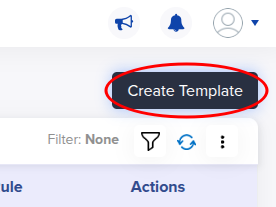
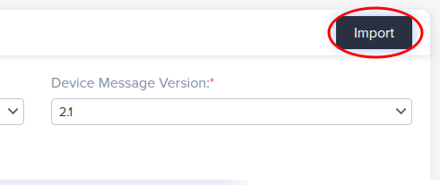
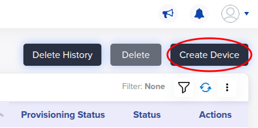
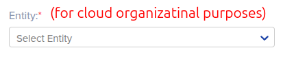
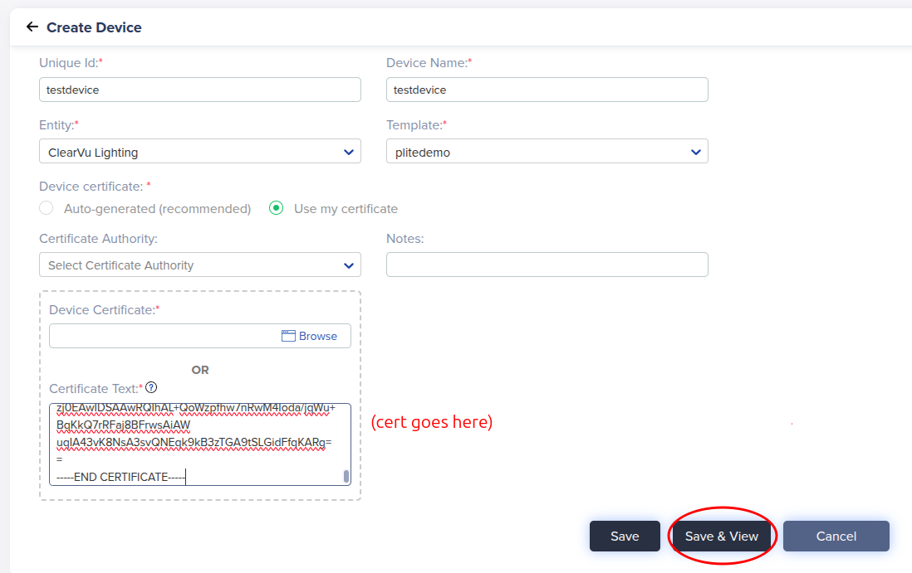
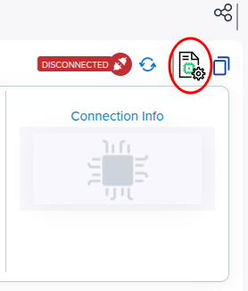
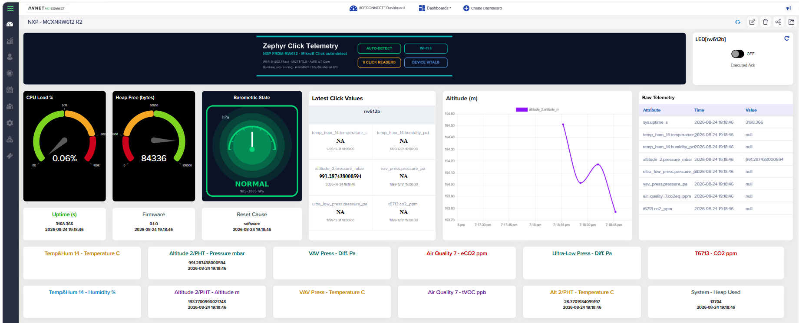

# FRDM-RW612 Quickstart


This guide provisions an NXP FRDM-RW612 to Avnet /IOTCONNECT over Wi-Fi using
a prebuilt binary. Nothing device- or network-specific is compiled into the
image: the Wi-Fi credentials are entered at the serial prompt and stored in
flash, and the device generates its own key and certificate on-chip. One
binary works on any network and any IOTCONNECT account.

| | |
|---|---|
| SoC | RW612 (Cortex-M33 at 260 MHz, tri-radio: Wi-Fi 6 + BLE + 802.15.4) |
| Build target | `frdm_rw612` |
| Connectivity | Onboard 2.4/5 GHz 802.11ax Wi-Fi, DHCP |
| Debug probe / console | Onboard MCU-Link (CMSIS-DAP), USB VCom at 115200 8N1 |

## Requirements

- FRDM-RW612 and a USB-C cable to the MCU-Link port (`J10`, the USB-C
  connector nearest the RESET button).
- A 2.4 or 5 GHz WPA2-PSK (or open) Wi-Fi network.
- An /IOTCONNECT account. Free trials are available:
  [via AWS Marketplace](https://github.com/avnet-iotconnect/avnet-iotconnect.github.io/blob/main/documentation/iotconnect/subscription/iotconnect_aws_marketplace.md)
  (60 days, AWS account required) or
  [via iotconnect.io](https://subscription.iotconnect.io/subscribe?cloud=aws)
  (30 days, no credit card). Check your spam folder for the temporary
  password after registering.
- A flashing tool: NXP LinkServer, MCUXpresso, or a J-Link (the MCU-Link can
  be reflashed with J-Link firmware). No Zephyr toolchain is required to use
  the prebuilt binary.
- A serial terminal at 115200 8N1. The MCU-Link enumerates as a USB serial
  port when the board is plugged in.

Starting from a machine with neither installed? [HOST-SETUP.md](../HOST-SETUP.md)
helps you choose between LinkServer and J-Link, install either on Windows or
Linux, verify the probe, and open the serial console.

## Flashing

1. Open the repository's
   [Releases page](https://github.com/avnet-iotconnect/iotc-zephyr-demos/releases)
   and, under the latest release's **Assets**, click the image for the
   demonstration you want — `frdm_rw612_quickstart.hex`,
   `frdm_rw612_telemetry.hex`, `frdm_rw612_c2d-led.hex`, or
   `frdm_rw612_click-telemetry.hex` (`SHA256SUMS.txt` has the checksums).
   Your browser saves it to your Downloads folder.
2. Flash it. The flash addresses are embedded in the `.hex`, so no load
   address is needed — just pass the file's full path:

   Windows:
   ```
   LinkServer flash RW612:FRDM-RW612 load "C:\Users\<you>\Downloads\frdm_rw612_quickstart.hex"
   ```
   Linux:
   ```sh
   LinkServer flash RW612:FRDM-RW612 load ~/Downloads/frdm_rw612_quickstart.hex
   ```
   With a J-Link instead, use `loadfile <same path>` at the J-Link
   Commander prompt; from a source build tree,
   `west flash -d build/quickstart_rw612` (the built artifact lands in
   `build/quickstart_rw612/zephyr/zephyr.hex`).

## Provisioning

Open the MCU-Link serial port. On first boot the device prints this guide on
its console. Then:

1. Store the Wi-Fi credentials (they persist in flash and survive both
   reboots and application reflashes):
   ```
   wifi cred add -s "<ssid>" -k 1 -p "<passphrase>"
   ```
   (`-k 1` is WPA2-PSK; use `-k 0` and no `-p` for an open network.) The
   device associates within a few seconds and acquires an address via DHCP —
   `wifi status` shows the link.
2. Generate the device identity on the device. Choose a DUID (Device Unique ID) for the board — you invent this
   yourself: up to 10 characters, letters and digits only, and it must
   start with a letter (e.g. `rw612a`). Then:
   ```
   iotcprov provision <your-duid>
   ```
   The device generates an EC P-256 key and self-signed certificate on-chip
   and prints the certificate.
3. Onboard the device in /IOTCONNECT (screenshots at each step):

   1. In a browser, open [console.iotconnect.io](https://console.iotconnect.io)
      and log in.

   2. In the left toolbar, hover over the processor icon and select
      **Device**, then click the **Templates** tab at the bottom of the page.

      
      

   3. Download the template for the demonstration you flashed — the template
      is fixed when the device is created:

      | Demonstration | Template |
      |---|---|
      | quickstart, telemetry | [templates/zephyr-telemetry-template.json](../../templates/zephyr-telemetry-template.json) |
      | c2d-led | [templates/c2d-led-template.json](../../templates/c2d-led-template.json) |
      | click-telemetry | [templates/click-demos-device-template.JSON](../../templates/click-demos-device-template.JSON) |

   4. Click **Create Template**, then **Import**, select the downloaded
      template file, and save.

      
      

   5. Click the **Devices** tab, then **Create Device**.

      
      

   6. Set **Unique ID** (and Device Name) to the DUID you provisioned in
      step 2, pick an Entity (organizational only), and select the imported
      template from the **Template** dropdown (begin typing to filter the
      list).

      

      

   7. In **Device Certificate**, choose **Use my certificate** and paste the
      certificate the board printed in step 2 (including the BEGIN and END
      lines), then click **Save and View**.

      

      

4. On the device's page, click the paper-and-cog icon (top right, above
   "Connection Info") to download `iotcDeviceConfig.json`; open it and copy
   its entire contents.

   

   Then paste it at the board's prompt:
   ```
   iotc config
   { ...paste the JSON block... }
   ```
5. Reboot to connect:
   ```
   kernel reboot cold
   ```
   The board associates, gets an address, and comes up as your device
   streaming telemetry.

## Dashboard

A ready-made dashboard ships for the click-telemetry demonstration — it
also works with no Clicks fitted (the vitals, LED control, and charts run
on always-live data; sensor tiles stay empty until a Click is inserted):



To import it:

1. Download
   [rw612-click-telemetry_dashboard_export.json](../../demos/click-telemetry/dashboard/rw612-click-telemetry_dashboard_export.json)
   (on GitHub, use the download button on the file page).
2. In /IOTCONNECT, select **Dashboards** → **Create Dashboard** →
   **Import dashboard**, give it a name, choose the JSON file, and when
   prompted select your device's **template** and your **device**.
3. The widgets bind to your device on import. If a widget shows no data,
   open its settings (the "..." menu) and re-select the device once.

## Building (optional)

Only needed if you are not using the prebuilt binary. The RW612 Wi-Fi
firmware ships as an NXP binary blob linked into the application; fetch it
once per workspace:

```sh
west blobs fetch hal_nxp
west build -p always -b frdm_rw612 -d build/quickstart_rw612 demos/quickstart \
  -- -DZEPHYR_EXTRA_MODULES=<path>/iotc-zephyr-sdk \
     -DZEPHYR_IOTC_C_LIB_MODULE_DIR=<path>/iotc-c-lib
```

In a workspace created from this repository's manifest
(`west init -m <repository URL> && west update`, per the
[repository README](../../README.md)), the SDK modules are already present
and the two `-D` flags are unnecessary.

## Board notes

- No devicetree overlay is needed for Wi-Fi: the SoC's `nxp,wifi` node is
  enabled by default. The demo board config selects the driver, the stored-
  credential auto-connect, and DHCP.
- Wi-Fi credentials and the cloud identity both live in the flash storage
  partition: provision once, then any of this board's demo binaries
  (quickstart, telemetry, c2d-led, click-telemetry) connects as the same
  device.
- `wifi cred list` shows the stored networks; `wifi cred delete "<ssid>"`
  forgets one. `wifi status` and `net iface` show the live link state.
- Key protection is software-only on this build: the device key is stored in
  NVS on the external FlexSPI flash and the debug port is open. The RW612's
  EdgeLock/TrustZone hardware is not yet wired up in upstream Zephyr for this
  target; see the SDK
  [key-protection matrix](https://github.com/avnet-iotconnect/iotc-zephyr-sdk/blob/main/docs/provisioning-nvs.md#key-protection--tf-m-capability-per-board).
- The Wi-Fi firmware blob (`rw61x_sb_wifi_a2.bin`) adds roughly 700 KB to the
  image; the board's 64 MB FlexSPI flash has ample room.

## Demonstrations for this board

See the demonstration list and verification status in
[README_NXP.md](../../README_NXP.md#frdm-rw612).
