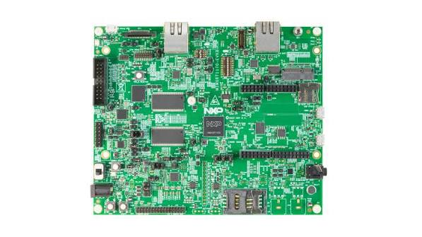

# MIMXRT1170-EVKB Quickstart



This guide provisions an NXP MIMXRT1170-EVKB to Avnet /IOTCONNECT using a
prebuilt binary. Device identity is generated on the device itself; no
credentials are stored on the host PC or compiled into the binary.

| | |
|---|---|
| SoC | i.MX RT1176 (Cortex-M7 at 1 GHz) |
| Build target | `mimxrt1170_evk/mimxrt1176/cm7` |
| Connectivity | Onboard 100 Mbit Ethernet, DHCP |
| Debug probe / console | Onboard MCU-Link (CMSIS-DAP), USB VCom at 115200 8N1 |

## Requirements

- MIMXRT1170-EVKB, a USB-C cable to the MCU-Link port, and an Ethernet
  connection with DHCP.
- A flashing tool: NXP LinkServer, MCUXpresso, or a J-Link. No Zephyr
  toolchain is required to use the prebuilt binary.
- A serial terminal at 115200 8N1.

Starting from a machine with neither installed? [HOST-SETUP.md](../HOST-SETUP.md)
walks through installing LinkServer and opening the serial console on Windows
and Linux.

## Flashing

The RT1170 boots from external QSPI flash:

```sh
LinkServer flash MIMXRT1176xxxxx:MIMXRT1170-EVKB \
    load --addr 0x30000000 zephyr.bin
# or, from a Zephyr workspace:
west flash -d build/quickstart_rt1170
```

The prebuilt artifact is `build/quickstart_rt1170/zephyr/zephyr.bin` (or
`.hex`) from [demos/quickstart](../../demos/quickstart).

## Provisioning

Open the MCU-Link VCom port. On first boot the device prints a provisioning
guide. Then:

1. Generate the device identity on the device:
   ```
   iotcprov provision <your-duid>
   ```
   The device generates an EC P-256 key and self-signed certificate on-chip
   and prints the certificate.
2. In /IOTCONNECT, first import a device template if you have none: Devices,
   then Templates, then Import, and select
   [templates/zephyr-telemetry-template.json](../../templates/zephyr-telemetry-template.json).
   Then select Devices, then Create Device: set the Unique ID to your chosen
   DUID, pick the imported template, select Self-Signed authentication, and
   paste the printed certificate.
3. Download `iotcDeviceConfig.json` from the device's Info panel, then paste
   it at the prompt:
   ```
   iotc config
   { ...paste the JSON block... }
   ```
4. Reboot to connect:
   ```
   kernel reboot cold
   ```
   The board comes up as your device and begins streaming telemetry.

## Board notes

- No overlay is needed for Ethernet: the board devicetree enables the ENET MAC
  and PHY by default. The demo configuration enables the network stack and
  DHCP.
- Reflashing works directly with `west flash`; no recovery procedure is
  needed on this board.
- The stored identity lives in the flash storage partition and survives an
  application reflash.
- Key protection is software-only on this board. The RT1176 is a Cortex-M7
  without TrustZone-M, so there is no TF-M target and the device-generated key
  is stored in NVS. For hardware-sealed key storage, see the FRDM-MCXN947 and
  the SDK
  [key-protection matrix](../../../iotc-zephyr-sdk/docs/provisioning-nvs.md#key-protection--tf-m-capability-per-board).
- click-telemetry requires a mikroBUS-to-Arduino adapter; the board has no
  mikroBUS socket.

## Demonstrations for this board

See the demonstration list and verification status in
[README_NXP.md](../../README_NXP.md#mimxrt1170-evkb).
