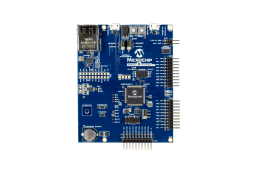

# SAM E54 Xplained Pro Quickstart



This guide provisions a Microchip SAM E54 Xplained Pro to Avnet /IOTCONNECT
using a prebuilt binary. Device identity is generated on the device itself; no
credentials are stored on the host PC or compiled into the binary.

| | |
|---|---|
| SoC | ATSAME54P20A (Cortex-M4F at 120 MHz, 1 MB flash, 256 KB RAM) |
| Build target | `same54_xpro` (Atmel-tree port; see Board notes) |
| Connectivity | Onboard 10/100 Ethernet (GMAC, KSZ8091 PHY), DHCP |
| Debug probe / console | Onboard EDBG (CMSIS-DAP), USB VCom at 115200 8N1 |

## Requirements

- SAM E54 Xplained Pro (ATSAME54-XPRO), a micro-USB cable to the DEBUG USB
  port, and an Ethernet connection with DHCP.
- A flashing tool: OpenOCD (the default `west flash` runner, which drives the
  onboard EDBG) or a J-Link on the 10-pin Cortex header. No Zephyr toolchain
  is required to use the prebuilt binary.
- A serial terminal at 115200 8N1.

## Flashing

```sh
west flash -d build/quickstart_e54
# or with a raw hex file and OpenOCD:
openocd -f board/microchip_same54_xplained_pro.cfg \
    -c "program zephyr.hex verify reset exit"
```

The prebuilt artifact is `build/quickstart_e54/zephyr/zephyr.hex` from
[demos/quickstart](../../demos/quickstart).

## Provisioning

Open the EDBG VCom port. On first boot the device prints a provisioning
guide. Then:

1. Generate the device identity on the device:
   ```
   iotcprov provision <your-duid>
   ```
   The device generates an EC P-256 key and self-signed certificate on-chip
   and prints the certificate.
2. In /IOTCONNECT, first import a device template if you have none: Devices,
   then Templates, then Import, and select
   [templates/zephyr-telemetry-template.json](../../templates/zephyr-telemetry-template.json).
   Then select Devices, then Create Device: set the Unique ID to your chosen
   DUID, pick the imported template, select Self-Signed authentication, and
   paste the printed certificate.
3. Download `iotcDeviceConfig.json` from the device's Info panel, then paste
   it at the prompt:
   ```
   iotc config
   { ...paste the JSON block... }
   ```
4. Reboot to connect:
   ```
   kernel reboot cold
   ```
   The board comes up as your device and begins streaming telemetry.

## Board notes

- No overlay is needed for Ethernet: the board devicetree enables the GMAC
  and PHY by default, and the factory MAC address is read from the onboard
  AT24MAC402 EEPROM, so every board has a stable, unique MAC out of the box.
- Two Zephyr targets exist for this board. The demonstrations use the
  Atmel-tree `same54_xpro` target, which has working Ethernet. Microchip's
  newer `sam_e54_xpro` tree does not carry a GMAC node yet; migrate the
  configurations when that support lands. The manifest pulls `hal_atmel` for
  this target.
- The stored identity lives in the flash storage partition (last 16 KiB) and
  survives an application reflash.
- Key protection is software-only on this board. The E54 is a Cortex-M4F
  without TrustZone-M, so the device-generated key is stored in NVS. For
  hardware-sealed key storage, see the FRDM-MCXN947 and the SDK
  [key-protection matrix](../../../iotc-zephyr-sdk/docs/provisioning-nvs.md#key-protection--tf-m-capability-per-board).
- Sensor wings attach to connector EXT1, whose I2C is SERCOM3 — a private
  bus, exposed by the demo overlays as `mikrobus_i2c`/`io1-i2c`. (EXT2 and
  EXT3 share SERCOM7 with the onboard EEPROM at 0x5E and ATECC508 at 0x60.)
  Two wing options:
  - IO1 Xplained Pro: AT30TSE758 temperature sensor at 0x4F (auto-detected by
    click-telemetry), TEMT6000 light sensor on EXT1 pin 3 (ADC1/AIN6), and an
    LED on EXT1 pin 7 (PB08, active low). This is the sensor set used by the
    ml-model-update demonstration.
  - mikroBUS Xplained Pro adapter (ATMBUSADAPTER-XPRO) for MikroE Click
    boards.
- The SERCOM I2C clocking on this board cannot reach 100 kHz standard mode
  (the divider bottoms out near 235 kHz), so I2C devices run in fast mode;
  devices limited to 100 kHz will not enumerate.

## Demonstrations for this board

See the demonstration list and verification status in
[README_MICROCHIP.md](../../README_MICROCHIP.md#sam-e54-xplained-pro).
