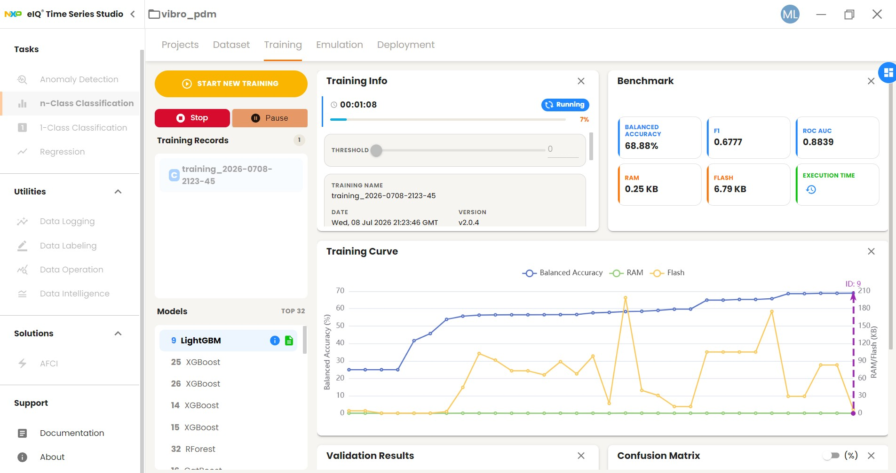
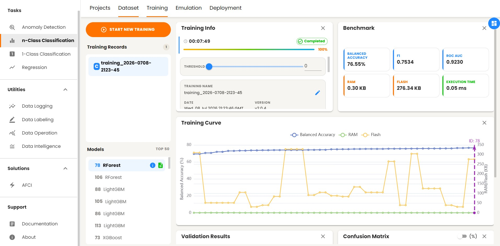
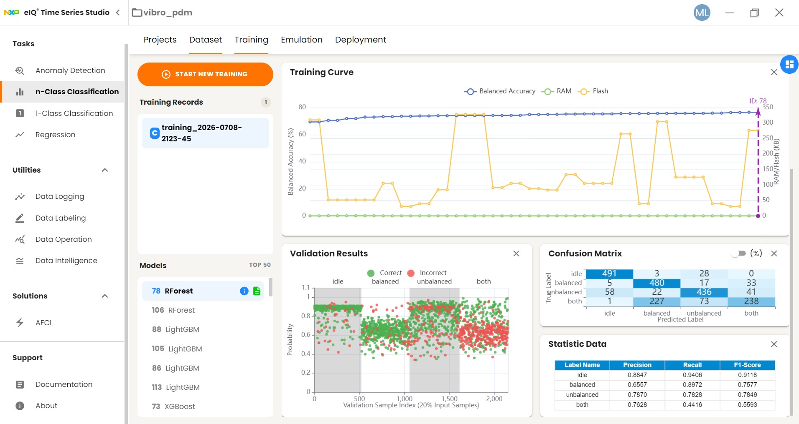
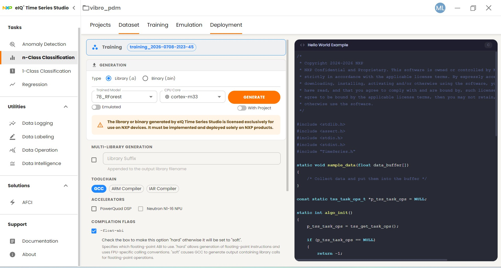
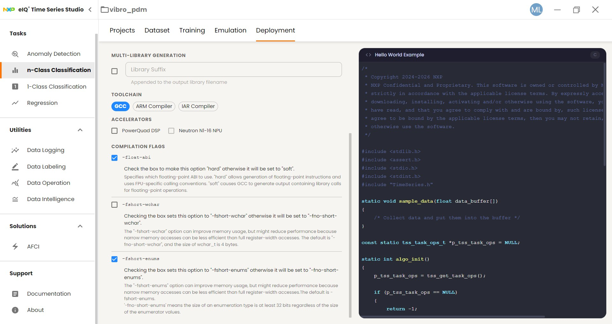

# /IOTCONNECT Quickstart — eIQ Predictive Maintenance (Vibration)

An end-to-end **ML predictive-maintenance** demo on the **NXP FRDM-MCXN947**: a
MIKROE **ML Vibro Sens Click** provides both the vibration *source* (two onboard
DC motors — one balanced, one unbalanced) and the *sensor* (NXP **FXLS8974CF**
accelerometer), an **eIQ Time Series Studio** model classifies the machine state
on-device, and the verdict streams to **/IOTCONNECT** — where you can inject a
fault **from the cloud** and watch the model catch it.


*ML Vibro Sens Click ([MIKROE-6470](https://www.mikroe.com/ml-vibro-sens-click)): the FXLS8974 sits between a balanced motor (left) and an unbalanced motor (right) — a self-contained PdM rig.*

| | |
|---|---|
| **Board** | [FRDM-MCXN947](https://www.nxp.com/design/design-center/development-boards-and-designs/FRDM-MCXN947) (`frdm_mcxn947/mcxn947/cpu0`) |
| **Click** | ML Vibro Sens Click on the mikroBUS socket (I²C `0x18` + BAL/UNB motor pins) |
| **Connectivity** | Onboard Ethernet (RJ45), DHCP |
| **Console** | MCU-Link VCom @ **115200 8N1** |
| **ML** | eIQ Time Series Studio (n-Class classification, Random Forest, ~276 KB / 0.05 ms) |

A **pretrained model ships in [`model/`](model/)** and the training data in
[`training/`](training/) — so you can go **straight to step 4** and only come
back to capture/train (steps 2–3) when you want to reproduce or improve it.

---

## 1. Hardware setup

1. Seat the **ML Vibro Sens Click** in the FRDM-MCXN947's mikroBUS socket (or a
   1-slot Shuttle).
2. USB-C into the **MCU-Link** port (debug + console), Ethernet into the RJ45.
3. Serial terminal on the MCU-Link VCom, 115200 8N1.

## 2. Capture training data *(optional — data is bundled)*

Build + flash the **capture** firmware (network-free):

```sh
west build -p always -b frdm_mcxn947/mcxn947/cpu0 -d build/eiq_vib \
  iotc-zephyr-demos/demos/eiq-pdm-vibration
west flash -d build/eiq_vib
```

The firmware cycles the Click's motors through labeled states (idle → balanced →
unbalanced → both, 4 s each) and streams **self-labeled CSV** — log the console
to a file for a few minutes:

```
VIB,t_ms,state,ax_g,ay_g,az_g
VIB,4002,balanced,0.155,0.085,1.180
...
```

Convert the log into TSS-ready per-class files:

```sh
python tools/tss_convert.py capture.log   # -> tss/{idle,balanced,unbalanced,both}.csv
```

## 3. Train in eIQ Time Series Studio *(optional — model is bundled)*

Install [eIQ Time Series Studio](https://www.nxp.com/design/design-center/software/eiq-ai-development-environment/eiq-time-series-studio:EIQ-TIME-SERIES-STUDIO)
and:

1. **Projects → New**: MCU **MCXN947**, task **n-Class Classification**,
   4 classes, sensor IMU, **3 channels**.
2. **Dataset → Import**: one file per class from step 2 (or from
   [`training/tss/`](training/tss/)) — **delimiter = Space, channels = 3**,
   sample rate ~100 Hz, one class label per file.
3. **Training**: model type **CML**, train/validation **0.8** → **Start**. The
   autoML explores tree models and ranks them:

   

   When it completes, the best model is selected (here: **Random Forest**,
   balanced accuracy 76.6 %, RAM 0.30 KB, Flash 276 KB, 0.05 ms):

   

   Check the confusion matrix + per-class metrics — `idle`/`balanced`/
   `unbalanced` separate cleanly; `both` overlaps `balanced` (physically
   expected — it runs the balanced motor too, and it maps to `fault` either
   way):

   

4. **Deployment → Generation** — these settings must match the Zephyr build:

   | Setting | Value |
   |---|---|
   | Type | **Library (.a)** |
   | CPU Core | **cortex-m33** |
   | Toolchain | **GCC** (Zephyr's toolchain) |
   | Accelerators | **both off** (CML doesn't use the Neutron NPU) |
   | `-float-abi` | **checked (hard)** — `connect.conf` sets `CONFIG_FPU=y` |
   | `-fshort-wchar` | unchecked |
   | `-fshort-enums` | **checked** |

   
   

   **Generate**, then unzip the package into [`model/`](model/) (`libtss.a`,
   `TimeSeries.h`, `algorithm.dat`, `metadata.json`). The build picks it up
   automatically.

## 4. Build + flash the connected firmware

The connect layer goes on via extra conf/overlay files — pass them as
**environment variables** (shell `-D` passthrough mangles Windows paths):

```sh
export ZEPHYR_EXTRA_MODULES=<path>/iotc-zephyr-sdk
export ZEPHYR_IOTC_C_LIB_MODULE_DIR=<path>/iotc-c-lib
export EXTRA_CONF_FILE=connect.conf
export EXTRA_DTC_OVERLAY_FILE=connect.overlay
west build -p always -b frdm_mcxn947/mcxn947/cpu0 -d build/eiq_vib_connect \
  iotc-zephyr-demos/demos/eiq-pdm-vibration
west flash -d build/eiq_vib_connect
```

Look for `eiq-pdm-vibration: linking eIQ TSS model from .../model` in the CMake
output — that confirms the trained classifier is in (FLASH ≈35 %). Without a
model present it falls back to an RMS heuristic (`vib.source` tells you which).

> **MCXN947 flash quirk:** if LinkServer reports `CRITICAL: Critical error`,
> unplug/replug the MCU-Link USB and reflash within a few seconds.

## 5. Provision — the device generates its own key

No credentials are compiled in. On first boot the console prints a guide:

```
iotcprov provision <your-duid>
```

→ the device generates an **EC P-256 key on-chip**, self-signs a certificate,
stores both in NVS, and prints the certificate PEM.

1. **Import the device template** (once): /IOTCONNECT → Device → Templates →
   Import → [`templates/eiq-pdm-vibration-template.json`](../../templates/eiq-pdm-vibration-template.json)
   (code `eiqpdmvib`).
2. **Devices → Create Device**: Unique ID = `<your-duid>`, template =
   **eIQ PdM Vibration**, auth **Self-Signed**, paste the printed certificate.
3. Download the device's `iotcDeviceConfig.json`, then on the console:
   ```
   iotc config
   { ...paste the json block... }
   ```
4. Connect:
   ```
   kernel reboot cold
   ```

It boots, loads the NVS identity, and connects: SNTP → discovery → mutual-TLS
MQTT → telemetry every ~2 s.

## 6. The demo — inject a fault from the cloud

From the device's **Command** panel send:

| Command | What you'll see |
|---|---|
| `inject-fault` | the **unbalanced motor** spins → `vib.state: fault`, `vib.model_class: unbalanced`, `anomaly_score` ≈ 1 |
| `inject-healthy` | the balanced motor spins → `vib.state: healthy`, `model_class: balanced` |
| `run-both` | both motors → `fault` (`model_class: both`) |
| `motor-stop` | motors off → `healthy` (`model_class: idle`) |
| `set-interval <s>` | reporting cadence |
| `reboot` | restart |

Telemetry (`vib` object): `state`, `anomaly_score` (mean fault probability from
the model), `rms_g`/`rms_x`/`rms_y`/`rms_z` (measured vibration), `motor` (what
the cloud asked the motors to do), `model_class` (raw class the model detected),
`source` (`eiq-model`) — plus the `sys` device-vitals object (CPU, heap, uptime).

The pitch: **`motor` is the injected ground truth, `model_class` is what the ML
detected** — watching them agree (within a second or two) *is* the demo.

## Files

| Path | What |
|---|---|
| [`src/main.c`](src/main.c) | capture + connect firmware (one source, two modes) |
| [`model/`](model/) | pretrained eIQ model (NXP license) — drop-in slot for your own |
| [`training/`](training/) | raw capture, per-class TSS files, training report PDF |
| [`tools/tss_convert.py`](tools/tss_convert.py) | capture log → TSS import files |
| [`docs/images/`](docs/images/) | the eIQ TSS screenshots used above |
| [`../../templates/eiq-pdm-vibration-template.json`](../../templates/eiq-pdm-vibration-template.json) | /IOTCONNECT device template |
