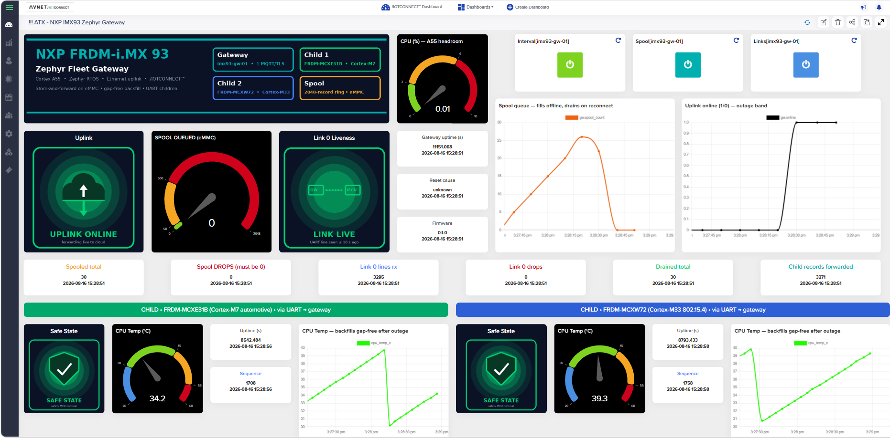
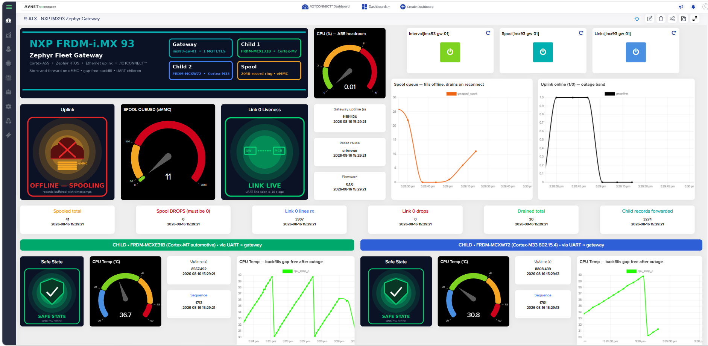

# Dashboard — fleet gateway

A ready-made IOTCONNECT dashboard export ships here:
[imx93-fleet-gateway_dashboard_export.json](imx93-fleet-gateway_dashboard_export.json)
— gateway health, the eMMC spool story, and live cards for **both child
devices**, on real hardware data. Mid-outage it looks like this (Ethernet
pulled — records buffering to the eMMC with their timestamps):

## Importing — read this first: it is a GATEWAY dashboard

This dashboard binds widgets to **three devices**: the gateway
(`imx93-gw-01`) **and its two child devices**. Child devices exist only
*under* the gateway (Gateway Device → Child Devices tab), and the device
picker lists them **prefixed with the gateway's ID** — e.g. the child you
created as `frdmmcxe31b01` appears as `imx93-gw-01-frdmmcxe31b01`. Have the
gateway + both children created and reporting **before** importing, or the
child widgets will show unbound ("Device Updated") placeholders.

1. **Prerequisites** (see the demo [README](../README.md) §Onboard): the
   `zephyrgw` gateway template imported — including the `sys` vitals object
   under **both** tags (`gw` and `uartsrc`) — the gateway device provisioned
   and connected, and the two children created with tag `uartsrc`.
2. **Dashboards → Create Dashboard → Import dashboard**, upload the JSON.
3. If the platform warns *"Some of the widget attribute(s) does not exist in
   device template"*, an attribute referenced by a widget is missing from
   your template (most commonly the child-tag `sys` object) — fix the
   template first, or OK through and expect those widgets to stay empty.
4. **Re-bind per device** in edit mode: the export carries this tenant's
   device GUIDs, so on any other account each widget needs its device
   re-selected once — gateway widgets to your gateway, each child card to
   the matching child (remember the gateway-prefixed names). The layout,
   gauges, zones, and image rules all survive re-binding.
5. The image widgets (uplink / link-liveness / safe-state icons and the
   header) reference PNGs by URL. Replace the URLs with images you host, or
   swap those widgets for plain value tiles.

## What the widgets tell, mapped to the demo script

| Widget | Bound to | The story |
|---|---|---|
| Uplink icon | gateway `gw.online` | flips ONLINE ↔ OFFLINE—SPOOLING on a cable pull |
| SPOOL QUEUED gauge | gateway `gw.spool_count` | **the hero**: fills during the outage, drains to 0 on reconnect |
| Spool queue chart | gateway `gw.spool_count` | the rise-and-drain curve of a healed outage |
| Uplink online chart | gateway `gw.online` | the outage band — backfilled `0` records mark exactly when |
| Link 0 Liveness icon | gateway `gw.link0_age_s` | LINK LIVE / STALE / LOST as sources go quiet |
| Spooled/Drained/Drops tiles | gateway `gw.spool_*` | the honesty accounting (pushed = drained, drops 0) |
| Child cards ×2 | each **child device** | safe-state shield, die-temp gauge, sequence/uptime, temp chart that **backfills gap-free** |
| Command buttons + console | gateway | `interval` / `spool-info` / `spool-wipe` / `links` with ACK history |

The child temperature charts are the quiet proof of store-and-forward: after
an outage the sawtooth continues without a gap, because every point traveled
with the timestamp it was captured at — not when it was finally sent.
