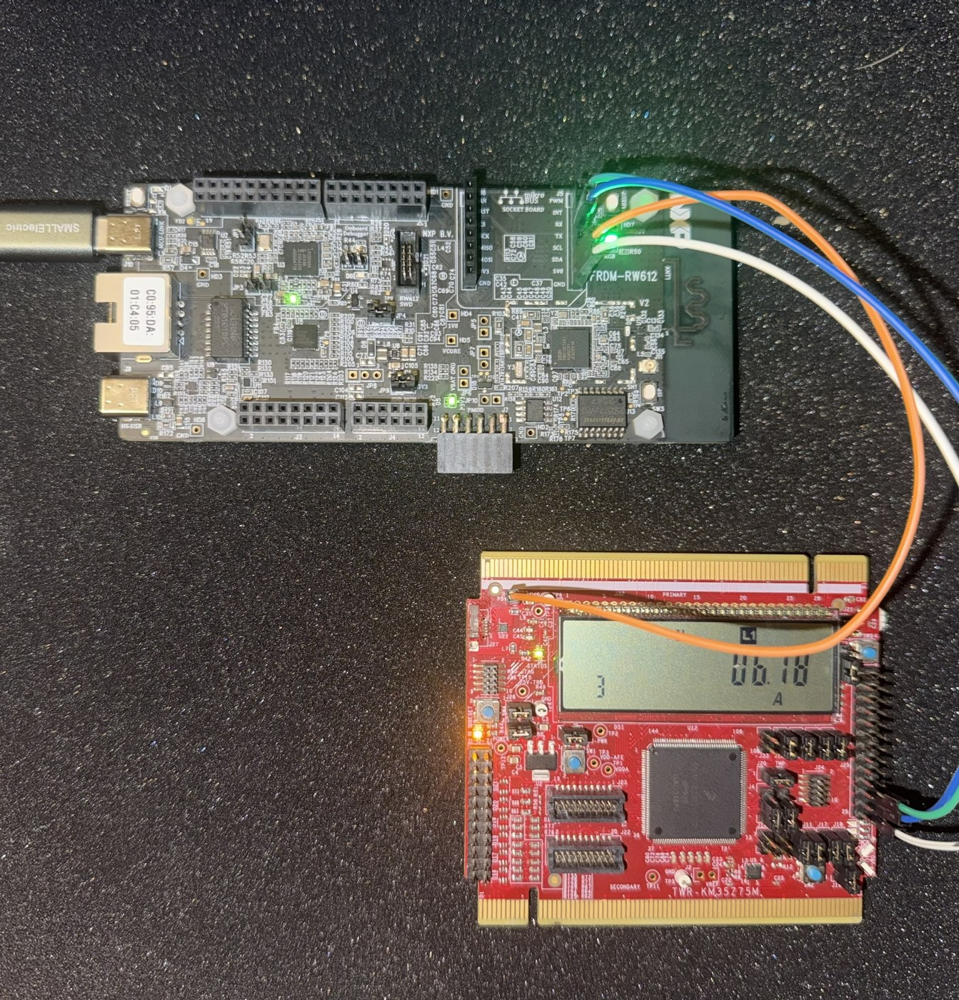
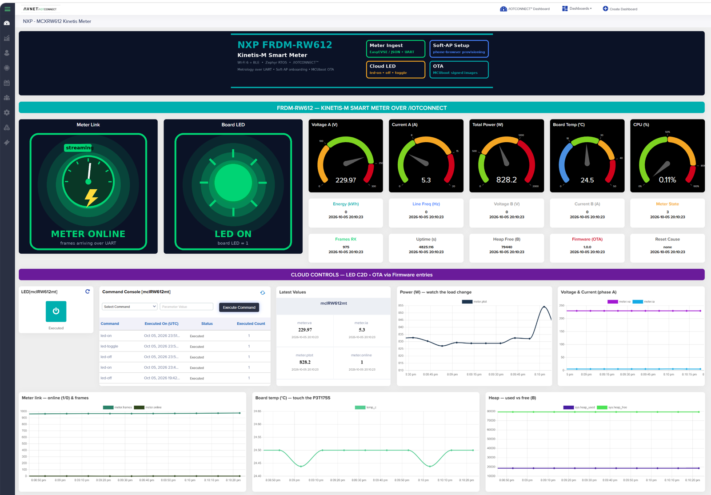

# Kinetis-M Meter Demo — Connection and Walkthrough

How to wire an external metrology board to the FRDM-RW612 and run the
full demo: phone onboarding, meter telemetry, LED commands, and OTA.

## 1. Hardware

| Item | Role |
|---|---|
| NXP FRDM-RW612 | Wi-Fi host, runs this firmware |
| Metrology board (e.g. NXP TWR-KM35 running the EasyEVSE metering firmware) | Measures and streams meter data over UART |
| 3 jumper wires | UART cross-over + ground |
| USB-C | Power (and optional console) for the FRDM-RW612 |

### Wiring

The meter connects to the FRDM-RW612 **mikroBUS** socket UART
(FLEXCOMM0). The console is a separate port (MCU-Link USB), so both can
be used at once.

| FRDM-RW612 mikroBUS pin | Direction | Metrology board |
|---|---|---|
| RX | <-- | UART TX |
| TX | --> | UART RX (optional, unused by this demo) |
| GND | --- | GND |

3.3 V logic levels. Both boards power from their own USB.



### Meter data format

Two formats are understood at **115200 8N1**, detected automatically:

**NXP EasyEVSE (TWR-KM35), out of the box.** The TWR-KM35 metering
firmware (project `TWRKM3575_EVSE`) ships with NXP's
[EasyEVSE EV charging station development platform](https://www.nxp.com/design/design-center/development-boards-and-designs/CONNECTED-EV-CHARGING-STATION)
([getting-started guide](https://www.nxp.com/document/guide/getting-started-with-nxps-easyevse-mcu-development-platform:GS-EVSE-EVCHARGING-FREERTOS));
build and flash it with MCUXpresso. The host polls with `'0'`
every 5 seconds (`CONFIG_METER_UART_POLL_CHAR` / `_INTERVAL`) and the
EasyEVSE firmware replies:

```
<I_RMS>[1]<U_RMS>[2]<P>[3]<Status_Index>[4]
```

mapped to `meter.ia`, `meter.va`, `meter.ptot`, `meter.state`. No change
to the EasyEVSE firmware is needed.

**JSON lines**, for any other metering firmware:

```json
{"va":119.8,"vb":120.1,"ia":0.81,"ib":0.79,"ptot":181.2,"kwh":22.244,"freq":60.01}
```

Keys are optional per line; unknown keys are ignored. To try the demo
with no meter at all, connect a USB-UART adapter and paste the JSON line
into a terminal.

## 2. Create the template and device

1. Import [`templates/kinetis-meter-template.json`](../../templates/kinetis-meter-template.json)
   (Devices -> Templates -> Import). If the import reports a duplicate
   message code, edit the `msgCode` value in the file to any unused
   7 characters.
2. No device creation needed up front — the onboarding portal does it.

## 3. Flash and onboard

Flash `frdm_rw612_kinetis-meter.hex` from
[Releases](https://github.com/avnet-iotconnect/iotc-zephyr-demos/releases)
(or `frdm_rw612_kinetis-meter_fota_base_v1.0.0.hex` for the OTA
exercise), or build it:

```sh
west build -p always -b frdm_rw612 -d build/kinetis_meter demos/kinetis-meter
west flash -d build/kinetis_meter
```

Then onboard either way:

### Option A: phone (Soft-AP portal, no console needed)

1. Power the board. It raises Wi-Fi network `IOTC-RW612-XXXX`.
2. Phone -> join that network -> browse **http://192.168.4.1**.
3. Follow the portal: home Wi-Fi, generate identity, create the device
   in /IOTCONNECT (template: **Kinetis-M Meter**), paste the
   config JSON, Finish.

### Option B: serial terminal

Open the MCU-Link console at 115200 8N1:

1. Store the home Wi-Fi:
   ```
   wifi cred add -s "<ssid>" -k 1 -p "<passphrase>"
   ```
2. Generate the identity on-chip (prints the certificate):
   ```
   iotcprov provision <your-duid>
   ```
3. Create the device in /IOTCONNECT: Devices -> Create Device,
   Unique ID = `<your-duid>`, template **Kinetis-M Meter**,
   **Self-Signed**, paste the certificate from step 2.
4. Download `iotcDeviceConfig.json` from the device's Info panel and
   paste it:
   ```
   iotc config
   { ...paste the whole json block... }
   ```
5. Reboot and connect:
   ```
   kernel reboot cold
   ```

## 4. What to show

- **Meter data**: `meter.va/vb/ia/ib/ptot/kwh/freq` update every 10 s
  while frames arrive; `meter.online` drops to 0 within 15 s of
  unplugging the meter UART.
- **Onboard temperature**: `temp_c` from the P3T1755 sensor. Touch the
  sensor to move it.
- **LED command**: send `led-on` / `led-off` / `led-toggle` from the
  device's Command panel; the board LED follows and the `led` attribute
  confirms on the next telemetry.
- **Wi-Fi recovery**: take the router down (or change its passphrase);
  after 90 s the setup AP returns with identity intact.
- **OTA**: upload a higher-version signed payload as a Firmware entry
  and push; `sys.fw` reports the new version after the MCUboot swap.
  Full flow: [DEVELOPER_GUIDE — FOTA](../../DEVELOPER_GUIDE.md#firmware-updates-over-the-air-fota).

**Quota note:** telemetry stops after 500 messages per boot (console
says so); `iotc limit <n>` changes it, reboot resets the counter.

## 5. Dashboard



A ready-made export ships in
[dashboard/kinetis-meter_dashboard_export.json](dashboard/kinetis-meter_dashboard_export.json):
meter link and LED state cards, phase gauges, power/voltage/current
trends, board temperature, vitals, and a command console.

Import via **Dashboards -> Create Dashboard -> Import dashboard**, then
select the **Kinetis-M Meter** template and your device. If the LED or
command-console widget imports unbound, re-select the command in the
widget editor.

## 6. OTA images for this demo

Built with sysbuild and published on the
[Releases page](https://github.com/avnet-iotconnect/iotc-zephyr-demos/releases);
three versions let the update be exercised twice:

| Artifact | Role |
|---|---|
| `frdm_rw612_kinetis-meter_fota_base_v1.0.0.hex` | Flash once over the probe (MCUboot + signed v1.0.0) |
| `frdm_rw612_kinetis-meter_fota_v1.0.1.signed.bin` | First OTA payload |
| `frdm_rw612_kinetis-meter_fota_v1.0.2.signed.bin` | Second OTA payload |

Evaluation images are signed with MCUboot's development key; production
uses your own key (see the developer guide's "Signing keys" section).
