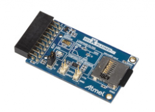
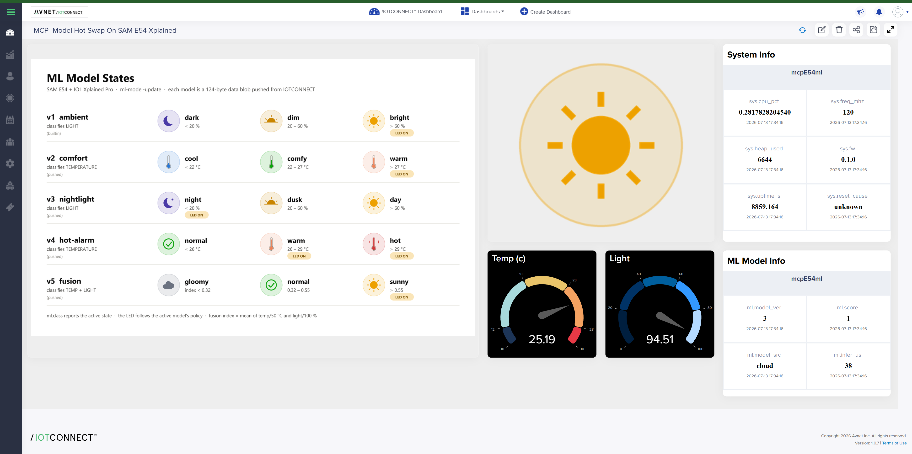

# ML Model Hot-Swap with /IOTCONNECT on Zephyr

*(demo directory: `ml-model-update`)*

> **[DEMO.md](DEMO.md)** walks the demo end to end — each step's observable
> behavior and what the device and platform are doing underneath.

**Overview:** the ML model on the device is *data, not
firmware*. The firmware ships a fixed tiny-MLP inference engine; a model is a
~124-byte validated blob (**IOTM** format: header + float32 weights + class
labels + LED policy). IOTCONNECT pushes a new model **as a C2D command** — the
device validates it (magic/format/dims/CRC32), hot-swaps it without a reboot,
persists it to NVS, and its behavior visibly changes. No reflash, no
toolchain, no OTA image — though the same blob could ride the platform's OTA
path for production fleets.

**Hardware:** SAM E54 Xplained Pro + **IO1 Xplained Pro** wing on **EXT1**
(AT30TSE758 temperature @ I²C 0x4F, TEMT6000 light → ADC1/AIN6, LED on PB08).

<p>
  
  
</p>

*SAM E54 Xplained Pro and the IO1 Xplained Pro sensor wing (plugs into EXT1).*

## The demo script

1. Boot: the built-in **v1 "ambient"** model classifies **light** —
   `dark / dim / bright` — and lights the IO1 LED on `bright`.
   Telemetry: `io1.*` sensors + `ml.class/score/model_ver/model_src/infer_us`.
2. From the IOTCONNECT device console send **`model-info`** → ACK shows
   `v1 builtin 124B 2-2-3 crc=... [dark/dim/bright]`.
3. Send the contents of [models/model_v2_comfort.cmd](models/model_v2_comfort.cmd)
   (a single `model-push <base64>` command, 179 chars). ACK:
   `model v2 installed (cloud)`.
4. The **same firmware** now classifies **temperature** —
   `cool / comfy / warm` — the LED lights on `warm`, and `ml.model_ver`
   flips to 2 on the dashboard. Warm the sensor with a fingertip and watch
   the class change.
5. `model-reset` reverts to the builtin; a pushed model **survives reboot**
   (NVS) until you reset it.

## Model catalog

Five ready-made models, each a one-command push with visibly different
behavior ([models/](models/), regenerate with `tools/build_model.py`):

| Ver | Name | Classifies on | Classes | LED policy | Demo move |
|---|---|---|---|---|---|
| v1 | ambient *(builtin)* | light | dark / dim / bright | on when **bright** | flashlight → LED on |
| v2 | comfort | temperature | cool / comfy / warm (22/27 °C) | on when **warm** | fingertip on sensor → LED on |
| v3 | nightlight | light | night / dusk / day | **inverted: on when night** | cover the sensor → LED on |
| v4 | hot-alarm | temperature | normal / warm / hot (26/29 °C) | on when warm **or** hot | trips within seconds of touch |
| v5 | fusion | temp **and** light (mean) | gloomy / normal / sunny | on when sunny | first multi-feature model |

## Native IOTCONNECT AI Model push (the platform feature)

The same blobs also ride IOTCONNECT's first-class
[C2D Model](https://dev-docs.iotconnect.io/c2d-model/) mechanism — no custom
command involved:

1. In IOTCONNECT: **AI Models → Create Model** — Name/Code (e.g.
   `nightlight`), Version (e.g. `3.0`), upload the
   [models/model_vN_*.zip](models/) file (a STORED single-entry archive the
   firmware unwraps on-device; ~260 B), leave SageMaker conversion off.
2. **Push Model** to the device.
3. The platform sends a module command (`ct:2`) with a signed download URL;
   the device fetches the blob over HTTPS (second TLS session), runs the same
   IOTM validation (magic/dims/CRC32), hot-swaps, persists to NVS, and sends
   the OTA-style **ack** (`model vN deployed (124 B)` — or the rejection
   reason).

Console shows `Model push from platform: host=...` → `model vN deployed`.
This path exercises the platform's model registry/versioning; the
`model-push` command below remains as the transport-minimal alternative
(handy where the template, not the model registry, defines the interaction).

Plumbing note: module commands (`ct:2`) share the OTA payload schema, so
`iotc-c-lib` routes them to the SDK's `ota_cb` (added in the local lib
checkout) and the app downloads via the SDK's `iotc_https_download()`.

## Commands

| Command | Param | Effect |
|---|---|---|
| `model-push` | base64 IOTM blob | validate + hot-swap + persist (one shot) |
| `model-begin` / `model-data` / `model-commit` | — / b64 chunk / — | chunked transfer for blobs beyond one command (up to 768 B) |
| `model-info` | — | ACK with version/source/dims/CRC/labels |
| `model-reset` | — | revert to the built-in model |
| `led-on` / `led-off` / `led-auto` | — | force the IO1 LED, or let the model drive it (blob `led_mask`) |
| `interval` | seconds | publish period (1–3600) |
| `reboot` | — | cold reboot (model persists) |

Every command is ACKed; rejected models get the reason in the ACK
(`rejected: weights CRC mismatch`, …).

## Building / making models

```sh
west build -p always -b same54_xpro -d build/ml-model-update \
  demos/ml-model-update \
  -- -DZEPHYR_EXTRA_MODULES=<path>/iotc-zephyr-sdk \
     -DZEPHYR_IOTC_C_LIB_MODULE_DIR=<path>/iotc-c-lib
```

Device template: [templates/ml-model-update-template.json](../../templates/ml-model-update-template.json).
Credentials: **none compiled in** — this is a flash-and-provision binary
(quickstart flow). At the shell: `iotcprov provision <duid>` (on-chip EC P-256
keygen, prints the cert) → import the template + Create Device (Self-Signed)
in IOTCONNECT → `iotc config` (paste `iotcDeviceConfig.json`) →
`kernel reboot cold`. Identity lives in NVS alongside the pushed models.

[tools/build_model.py](tools/build_model.py) constructs both models
deterministically, **brute-force verifies** their class bands against the
same math the firmware runs, and regenerates `src/model_builtin.h` +
`models/model_v2_comfort.{b64,cmd}`. To make your own model: emit any
`n_in≤4, n_hid≤16, n_out≤4` MLP in the IOTM layout (see the tool's header
comment) — trained weights work exactly like handcrafted ones, as long as the
inputs use the same feature scaling (`temp_c/50`, `light_pct/100`).

## Dashboard

A ready-made IOTCONNECT dashboard for this demo — live sensors, the model's
current state, system vitals, and the states legend:



To import it into your IOTCONNECT account:

1. Import the device template and create your device first (the dashboard
   binds to the template's attributes):
   [templates/ml-model-update-template.json](../../templates/ml-model-update-template.json).
2. In IOTCONNECT: **Create Dashboard → Import dashboard**, and select
   [dashboard/e54-model-hot-swap_dashboard_export.json](dashboard/e54-model-hot-swap_dashboard_export.json).
3. Name the dashboard and, when prompted, bind the device-bound widgets to
   your device.
4. Save. If the states-legend image widget comes up empty, edit it and point
   its image URL at a hosted copy of
   [media/ml-states-legend.png](media/ml-states-legend.png) (or switch the
   widget to upload mode and upload the file).

### Dashboard assets

[media/](media/) carries the underlying art, regenerated by
`tools/make_icons.py` (Pillow):

- [media/icons/state-\<label\>.png](media/icons/) — one 256×256
  transparent-background icon per class label `ml.class` can report
  (dark/dim/bright, cool/comfy/warm, night/dusk/day, normal/hot,
  gloomy/sunny). Map them to state values in dashboard widgets.
- [media/ml-states-legend.png](media/ml-states-legend.png) — a 1600×1000
  legend explaining every model's states, thresholds, and LED policy;
  insert it into the dashboard as a graphic.
- [media/dashboard.png](media/dashboard.png) — the imported dashboard,
  live against a provisioned device.

## IOTM blob format (v1)

| Off | Size | Field |
|---|---|---|
| 0 | 4 | magic `IOTM` |
| 4 | 2 | format version (1) |
| 6 | 2 | model version (telemetry `ml.model_ver`) |
| 8 | 4 | `n_in, n_hid, n_out, led_mask` |
| 12 | 48 | class labels, 4×12 chars |
| 60 | 4 | CRC32 (IEEE) of the weights |
| 64 | … | float32 LE: `W1[n_hid][n_in] b1 W2[n_out][n_hid] b2` |

Inference: `argmax(W2·relu(W1·x+b1)+b2)`, measured on-device and reported as
`ml.infer_us` (single-digit µs for these sizes on the 120 MHz Cortex-M4F).
