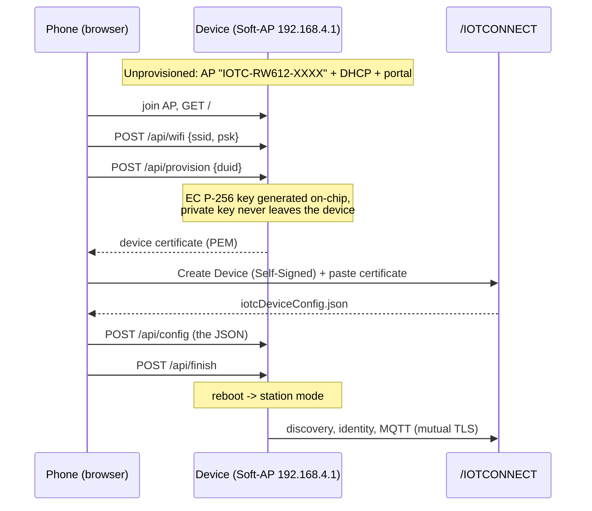
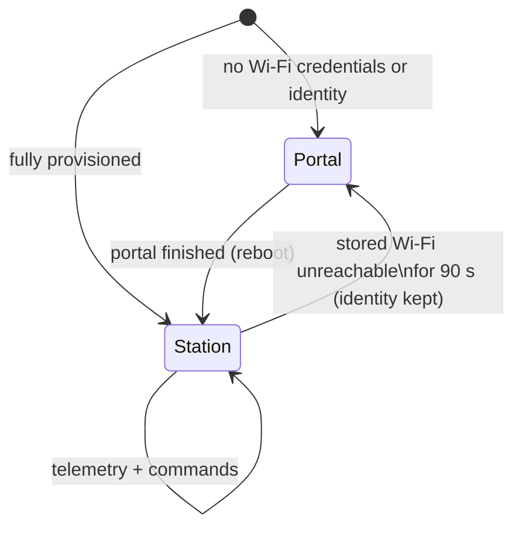
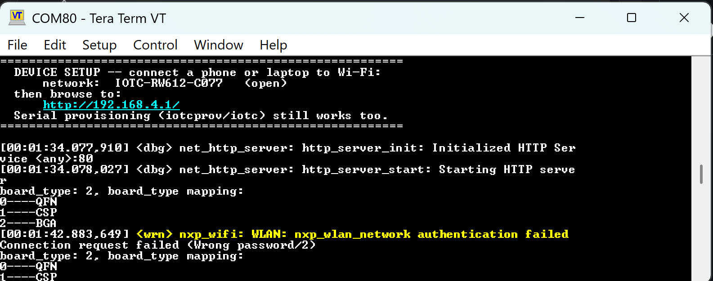
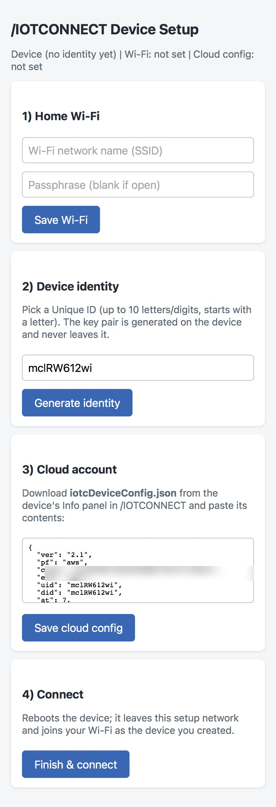

# Soft-AP Provisioning

Onboard a device to /IOTCONNECT from a phone browser — **no serial
console, no toolchain, no app install**. An unprovisioned device raises
its own Wi-Fi access point and serves a one-page setup portal; a
provisioned device skips the portal and runs the normal quickstart
telemetry loop.

> **Proof of concept.** The web portal demonstrates the mechanism:
> everything needed to onboard a device — joining it, exchanging Wi-Fi
> credentials, triggering on-device key generation, and delivering the
> cloud configuration — works over a local connection with no console.
> The same device-side endpoints, paired with the
> [/IOTCONNECT REST API](https://docs.iotconnect.io/iotconnect/rest-api/)
> for the account-side steps (device creation, config download), are how
> a production **iOS/Android onboarding app** would do this end to end —
> the app replaces both the browser and the manual portal steps.

## How it works



## Device states



The fallback arrow is the field case: if the stored network cannot be
joined for **90 seconds** (replaced router, changed passphrase, moved
device), the setup AP comes back on its own so the Wi-Fi can be
corrected from a phone — identity and cloud configuration are kept, so
only step 1 is needed. The console narrates exactly this on hardware —
the stored network failing authentication, then the setup AP returning:



Every portal step is also optional in isolation — the status line shows
what is already stored.

## The portal



Serial provisioning (`iotcprov provision`, `iotc config`) remains
available at every point.

## Run it

```sh
west build -p always -b frdm_rw612 -d build/softap_prov demos/softap-provisioning
west flash -d build/softap_prov
```

1. Power the board unprovisioned — console prints the AP name.
2. Phone → Wi-Fi `IOTC-RW612-XXXX` (open; tap "stay connected" if asked)
   → browse **http://192.168.4.1**.
3. Follow the four steps on the page; the device reboots and connects.
   Telemetry appears under the device (template
   [`zephyr-telemetry-template.json`](../../templates/zephyr-telemetry-template.json)).

| Board | Status |
|---|---|
| FRDM-RW612 (`frdm_rw612`) | portal + Wi-Fi change hardware-verified; see notes |

## Security notes

- The setup AP is open by design and only exists while unprovisioned (or
  unreachable); nothing secret crosses it — the certificate is public and
  the Wi-Fi passphrase is immediately at rest in flash. For production,
  WPA2 on the setup AP with a per-device label password is a small
  configuration change.
- The device private key is generated on-chip and never transits the
  portal.
