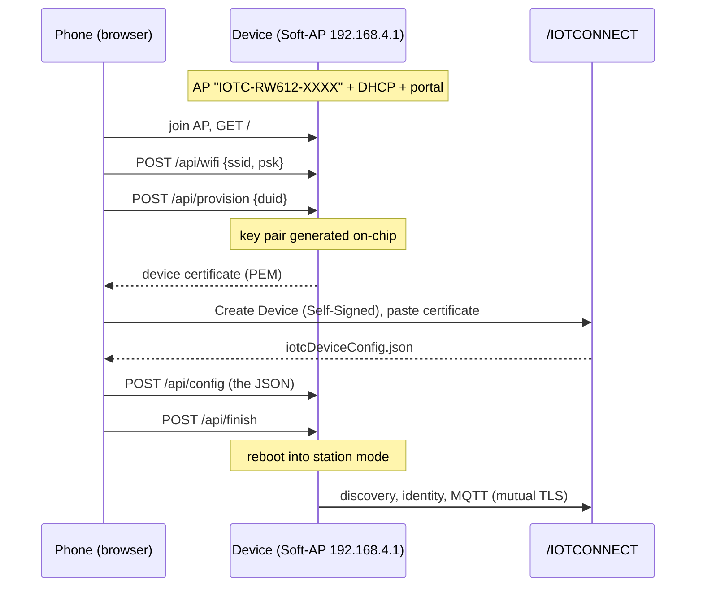
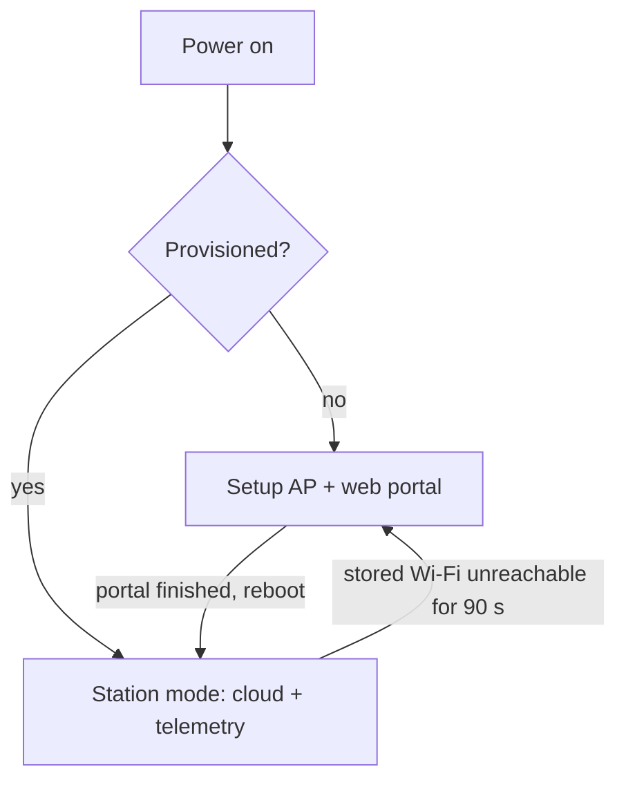
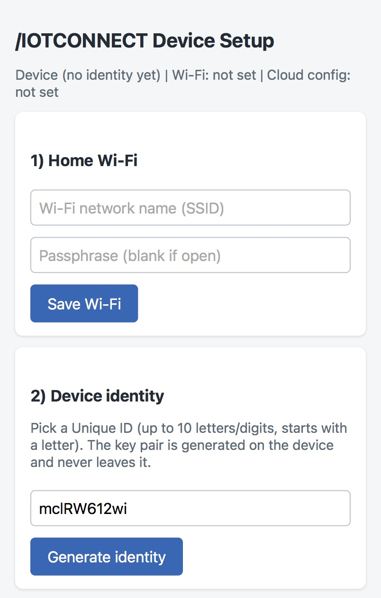
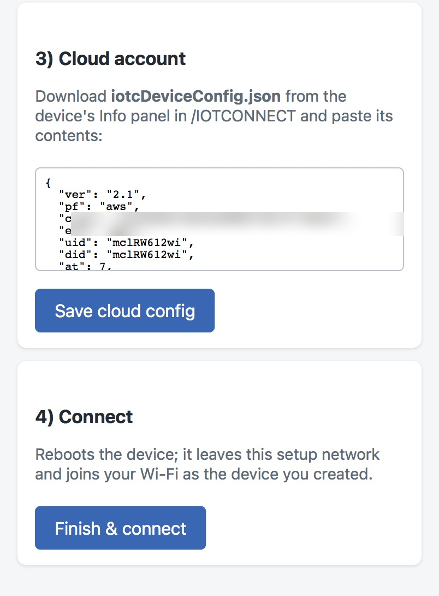

# Soft-AP Provisioning

Onboard a device to /IOTCONNECT from a phone browser. An unprovisioned
device raises its own Wi-Fi access point and serves a one-page setup
portal; a provisioned device skips the portal and runs the normal
quickstart telemetry loop.

> **Proof of concept.** The web portal demonstrates that onboarding
> works over a local connection: Wi-Fi credential exchange, on-device
> key generation, and cloud configuration delivery. A production
> iOS/Android app would use the same device endpoints together with the
> [/IOTCONNECT REST API](https://docs.iotconnect.io/iotconnect/rest-api/)
> to automate the account-side steps as well.

## How it works



## Device states



If the stored network cannot be joined for 90 seconds, the setup AP
comes back so the Wi-Fi can be corrected from a phone. Identity and
cloud configuration are kept; only step 1 is needed. The console shows
the stored network failing and the setup AP returning:


Each portal step can also be used alone; the status line shows what is
already stored.

## The portal

 

Serial provisioning (`iotcprov provision`, `iotc config`) remains
available at every point.

## Run it

```sh
west build -p always -b frdm_rw612 -d build/softap_prov demos/softap-provisioning
west flash -d build/softap_prov
```

1. Power the board unprovisioned; the console prints the AP name.
2. Connect a phone to Wi-Fi `IOTC-RW612-XXXX` and browse to
   **http://192.168.4.1** (tap "stay connected" if asked).
3. Follow the four steps on the page; the device reboots and connects.
   Telemetry appears under the device (template
   [`zephyr-telemetry-template.json`](../../templates/zephyr-telemetry-template.json)).

| Board | Status |
|---|---|
| FRDM-RW612 (`frdm_rw612`) | portal + Wi-Fi change hardware-verified |

## Security notes

- The setup AP is open and exists only while the device is unprovisioned
  or its network is unreachable. Nothing secret crosses it: the
  certificate is public and the Wi-Fi passphrase goes straight to flash.
  Production devices should use WPA2 on the setup AP with a per-device
  label password.
- The device private key is generated on-chip and never leaves the
  device.
