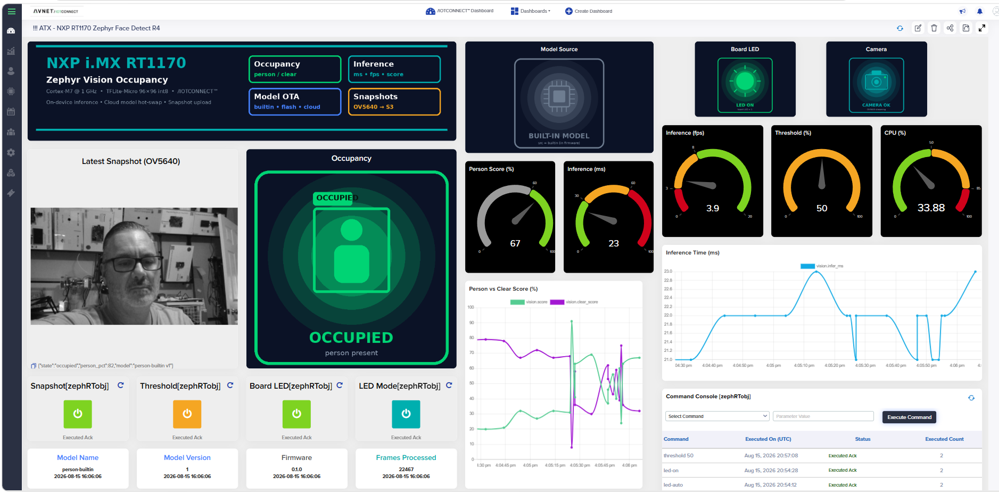

# Vision occupancy — edge person detection (MIMXRT1170-EVKB)

> **[QUICKSTART.md](QUICKSTART.md)** is the step-by-step bring-up;
> **[DEMO.md](DEMO.md)** walks the demo end to end — each step's observable
> behavior and what the device and platform are doing underneath.

On-device **person detection** on the NXP **MIMXRT1170-EVKB**: the **OV5640
camera module shipped with the kit** (J2, MIPI CSI-2) streams 720p frames, a
**TFLite-Micro person-detect CNN** (int8 MobileNet, 96×96 grayscale, CMSIS-NN
kernels on the 1 GHz Cortex-M7) classifies each frame **on the device**, and an
occupancy state machine streams the verdict to IOTCONNECT. **No video leaves
the board** — the cloud sees scores and states, never pixels, unless a
`snapshot` command explicitly requests one frame.



Three things this demo shows:

1. **Edge inference as telemetry** — `vision.*` carries the person score,
   OCCUPIED/CLEAR state, inference latency and frame rate; the board LED
   mirrors occupancy and the dashboard flips within a second of someone
   entering the frame.
2. **Cloud-requested snapshots into Telemetry Files** — a `snapshot` command
   captures one frame, encodes it as a grayscale **PNG on the device**, and
   uploads it through the platform's file pipeline (mutual-TLS AWS
   credentials → SigV4-signed S3 PUT → announce), tagged with the model's
   live verdict as its **Classification**. The image renders in the device's
   **Telemetry Files** panel. The camera answers only when asked.
3. **The model is data, not firmware** — like the
   [ml-model-update](../ml-model-update) demo, scaled from 124-byte MLPs to
   ~300 KB CNNs: a new `.tflite` arrives via the platform's native **AI Model
   push** (or a `model-fetch <url>` command) in an **IOTV envelope**
   (magic/version/CRC32), is trial-loaded with rollback, **hot-swapped without
   a reboot**, and persisted to spare flash so it survives power cycles.

## Hardware

- **MIMXRT1170-EVKB** with the bundled **OV5640 camera module** on **J2**
  (both the camera and the 44-pin cable ship in the kit box).
- Ethernet cable into the RJ45 (DHCP). USB-C to the MCU-Link port for
  console + flashing. No LCD needed — the dashboard is the viewfinder.

## Build

Prerequisites: a Zephyr v4.4.1 workspace with the `iotc-zephyr-sdk` module and
the **tflite-micro** optional module. From this repo's manifest both come with
`west update`; in a vanilla zephyrproject workspace add tflite-micro with:

```sh
west config manifest.project-filter -- +tflite-micro
west update tflite-micro
```

Then build with the camera shield:

```sh
west build -p always -b mimxrt1170_evk/mimxrt1176/cm7 --shield nxp_btb44_ov5640 \
  -d build/vision_occ demos/vision-occupancy \
  -- -DZEPHYR_EXTRA_MODULES=<path>/iotc-zephyr-sdk \
     -DZEPHYR_IOTC_C_LIB_MODULE_DIR=<path>/iotc-c-lib
west flash -d build/vision_occ      # onboard MCU-Link (LinkServer)
```

The built-in model is the stock TFLM `person_detect.tflite` (Apache-2.0),
embedded at build time straight from the tflite-micro module — no model binary
lives in this repo.

## Onboard

Provisioning is the quickstart flow (identity in NVS, key generated on-chip;
see the [board quickstart](../../boards/mimxrt1170-evkb/QUICKSTART.md)):

1. Import [templates/vision-occupancy-template.json](../../templates/vision-occupancy-template.json)
   (code `visionocc`) in IOTCONNECT.
2. On the serial console: `iotcprov provision <duid>` → **Create Device**
   (Self-Signed) with the printed certificate.
3. `iotc config` → paste the device's `iotcDeviceConfig.json` → `kernel reboot cold`.

## Run

On boot (before any network) the firmware runs a **bench self-test**: it
captures a frame and logs the model's person/no-person scores — point the
camera at yourself and watch the console prove the whole vision path without
a cloud account. Then it connects and publishes every `interval` seconds, or
immediately when occupancy flips.

| Command | Effect |
|---|---|
| `snapshot` | capture → on-device PNG → **Telemetry Files** (with the live verdict as Classification) |
| `threshold <1-99>` | occupancy trigger on the person score (default 60) |
| `interval <sec>` | publish interval (default 10) |
| `led-on` / `led-off` / `led-auto` | LED override / follow occupancy |
| `model-info` | ACK with active model version/name/CRC/arena |
| `model-fetch <https-url>` | pull + hot-swap a model (IOTV, raw `.tflite`, or STORED zip) |
| `model-reset` | erase the flash copy, revert to the built-in model |
| `reboot` | cold reboot |

### Snapshot

Send `snapshot` and open the device's **Telemetry Files** panel: the 320×180
grayscale PNG appears as a card within a few seconds, its Classification
showing `{"state":..., "person_pct":..., "model":...}` from the moment of
capture. Requires **File Support** enabled on the template (the shipped
template has it on) — the firmware handles the whole AWS path, including the
STS AssumeRole hop for customer-owned buckets
(`CONFIG_IOTCONNECT_FILE_UPLOAD` in the SDK).

Bench equivalents on the serial shell, no cloud needed: `vision status`
(live scores), `vision upload` (same Telemetry Files path), and
`vision snap`, which dumps the frame as base64 over the console — decode with
[tools/decode_console_snap.py](tools/decode_console_snap.py).

### Model update

Pack any int8 96×96×1 two-class `.tflite` (see
[tools/pack_model.py](tools/pack_model.py)):

```sh
python tools/pack_model.py my_model.tflite --version 2 --name person-v2
```

Two delivery paths:

- **Platform AI Model push** — upload `person-v2_v2.zip` under
  **Devices → AI Models** and push it to the device. The push arrives as an
  OTA-schema command with a download URL; the firmware downloads, validates
  (envelope CRC + a trial interpreter load with rollback), swaps the model
  live, persists it, and ACKs with the new version.
- **`model-fetch <url>`** — same pipeline from any HTTPS host the broker CA
  chain can verify (S3 presigned URLs work).

`model.ver` / `model.name` / `model.src` in telemetry flip on the dashboard
the moment the swap lands — same firmware, new eyes. A pushed model survives
reboot (it is restored from flash before the built-in is considered);
`model-reset` reverts.

**Where it persists:** NVS items cap out far below 300 KB, so the model is
written raw into the unused `slot1_partition` (7 MB) via the flash-area API.
If you combine this demo with MCUboot dual-slot OTA, give the model store its
own partition instead.

## Dashboard

A ready-made dashboard export ships in
[dashboard/](dashboard/) — the layout in the screenshot at the top of this
page, including the **Latest Snapshot** image widget fed by Telemetry Files.
Import
[dashboard/rt1170-vision-occupancy_dashboard_export.json](dashboard/rt1170-vision-occupancy_dashboard_export.json)
via **Dashboards → Create Dashboard → Import dashboard** and bind the widgets
to your device (any device on the `visionocc` template). Widget-by-widget
notes in [dashboard/README.md](dashboard/README.md).

## Telemetry

`vision.person/state/score/clear_score/threshold/infer_ms/fps/frames/cam_ok`,
`model.ver/name/src/size_b/arena_b`, `led`, and the `sys.*` device-vitals
sidecar; snapshots arrive as **Telemetry Files**, not telemetry attributes.
See the [template](../../templates/vision-occupancy-template.json) for the
full attribute set.

## Notes

- Capture runs at the pipeline's native **1280×720 BGRX32 ("XR24")** — the
  only format this CSI chain accepts (QVGA RGB565 is rejected;
  hardware-observed). The model sees an undistorted **center-square crop**,
  area-averaged to 96×96 grayscale — for a desk-style scene, center the
  subject (a person at frame-edge scores markedly lower). Snapshots are the
  full frame decimated to 320×180.
- A camera fault (module unseated, missing `--shield` flag) does not brick the
  demo: the device still provisions, connects, and reports `vision.cam_ok: 0`.
- The stock model's arena use (~100 KB) is reported at boot and in
  `model.arena_b`; the firmware reserves 192 KB in SDRAM for pushed variants.
